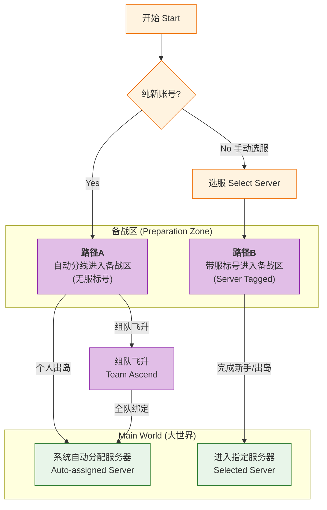
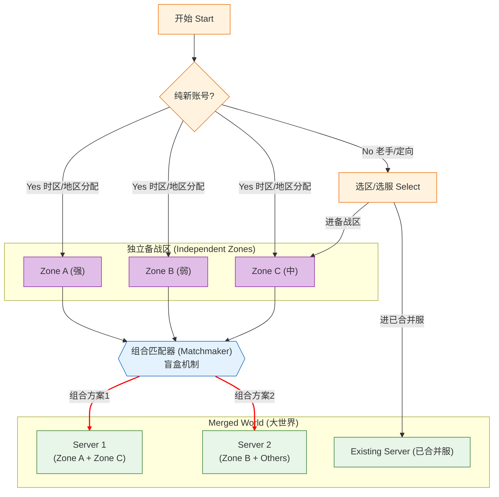
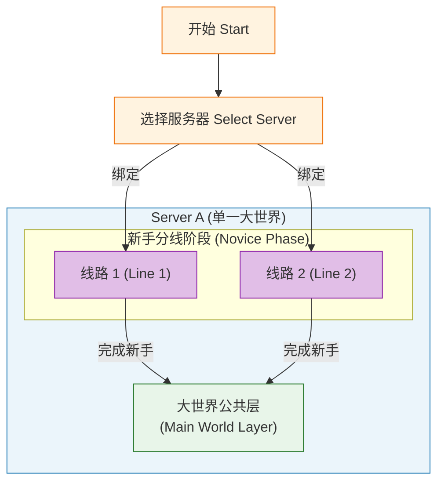
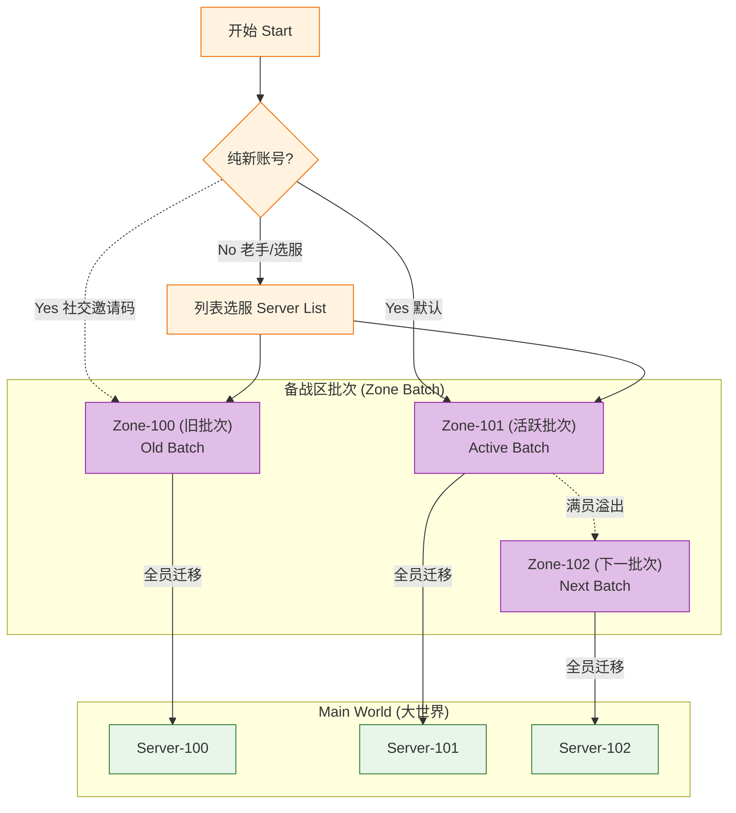

# 游戏分线设计方案与规则详案

## 0. 背景：生态导量与社交分割风险

> **核心矛盾**：
> *   **物理极限**：新手区单线人数上限被严格设定为 **300人**。这是基于地图尺寸的物理极限（该地图面积仅相当于大世界的一个行省，再扩容将导致体验崩坏）。
> *   **社交风险**：在自然导量下，海量玩家将被分散到无数个平行的“300人线路”中。**我和我的朋友极大概率不会被分配在同一个线路**。
> *   **后果**：这将导致严重的**初始社交割裂**问题。朋友之间无法见面、无法组队。本设计方案的核心挑战，即是如何在这一物理限制下，提供便捷的“合流/切线”机制。

### 0.1 已确认设计 (Confirmed Design Points)
*   **新手区分线隔离**：备战区（新手区）采用单线隔离模式，不同线路的玩家无法直接互通（无法见面、无法直接组队）。
*   **大世界单线合流**：正式进入服务器（大世界）后，所有玩家将被强制合并到同一条线路。
*   **大世界无分线**：服务器大世界本身不采用分线/频道机制，保证单一大世界体验。

### 0.2 待讨论议题 (Open Questions)
1.  **合线方案对齐**：需确认新手区分线结束后，如何平滑过渡到大世界单线的具体方案，以及在此过程中的社交体验细节。
2.  **合线时间点**：需确认合线（进入大世界）的具体时间点是 **次日 (Day 2)** 还是 **三日 (Day 3)**。

### 0.3 生态导量推演 (Calculator Logic)
*   **输入假设**：
    *   月留稳固生态目标：800人
    *   **次留/三留**：40% / 30% (决定大地图初始转化率)
    *   30日留存率：10%
    *   **单线承载上限：300人**
*   **推演结果**：
    *   单服所需总导量：8000人 (800 / 10%)
    *   **大地图初始人数**：3200人 (按次留40%计算)
    *   **所需平行线路数：27条** (8000 / 300)
    *   **结论**：玩家被分散在27个平行世界中，朋友被分在不同世界的概率极高。必须依赖社交锚点或备战区机制来解决。

---

## 1. 方案概览与对比

为适应不同运营策略与玩家习惯，本案提供三种分线/进入模式的备选方案。

| 特性 | 方案1：备战区个人匹配+组队飞升 | 方案2：备战区动态组合匹配 | 方案3：传统MMO 选服 | 方案4：批次导量 |
| :--- | :--- | :--- | :--- | :--- |
| **核心逻辑** | **个人动态匹配**。备战区混居，出岛时按生态分配。 | **区域动态重组**。备战区为独立单元，出岛时多个备战区**合并**为一个大世界服。 | **直接选服**。无备战区中转，创角即绑定服务器。 | **批次直通**。导量即定服，备战区仅为目标服的“新手村”。 |
| **选服时机** | 出岛时系统分配 (或创角可选目标) | 出岛/合服时由系统根据生态进行**组合匹配** | 登录界面明确选择 | 进入备战区前自动/被动分配批次 |
| **社交关系** | **弱前置**。备战区不同线无法组队，出岛后汇合。 | **区域内强，区域外未知**。本备战区关系保留，合服后遇到陌生人。 | **强绑定**。仅限同服社交，选错服需重练。 | **强前置**。备战区社交关系100%保留至大世界。 |
| **生态调节** | **强**。可根据留存率动态向各服补人。 | **较强**。可通过组合“活跃区”与“一般区”来平衡大世界生态。 | **弱**。热门服排队，冷门服鬼服，无法干预。 | **中**。依赖批次导入量，有死服风险。 |
| **适用场景** | 强调生态平衡、无缝体验的开放世界。 | 强调优胜劣汰、赛季制或强竞争的创新型MMO。 | 强调传统选服认知、强社交链的产品。 | 强调公会备战、团体进驻的SLG/MMO。 |
| **核心参考** | **指尖无双** | **(无参考创新方案)** | **魔兽世界 (WOW)** | **SLG类 (如万国觉醒)** |
| **参考体验** | “无感分线，动态合流”。玩家初期感知不到服务器存在，玩到后期才意识到被分配。 | “盲盒式合服”。我们在A区发育，不知道未来会和B区还是C区合并，充满变数。 | “选服定终身”。进服前需查攻略选“大服”，进服即绑定，社交边界清晰明确。 | “抱团落地，集体发育”。落地即建盟，整个批次就是未来的国家/服务器，全区即战友。 |
| **优点 (Pros)** | 生态平衡极佳，鬼服风险低； 对独狼玩家友好； 服务器负载可完美控制。 | 生态容错率高 (烂区可合并)； 合服事件本身具有极强的话题性与期待感； 初期社交密度适中。 | 认知成本最低，符合老玩家习惯； 强社交粘性，服务器荣耀感强； 无需复杂的合线逻辑。 | 社交关系稳固，公会管理方便； 归属感强，目标一致； 适合大团体进驻。 |
| **缺点 (Cons)** | <ul><li>早期社交割裂</li><li>朋友汇合繁琐</li><li>服务器概念弱</li></ul> | <ul><li>**朋友分离风险极高** (若分在不同Zone且未合并)</li><li>未来不确定性焦虑</li><li>技术实现复杂</li></ul> | <ul><li>排队 vs 鬼服</li><li>负载不均</li><li>新人融入难</li></ul> | <ul><li>死服风险无法逆转</li><li>流量控制难</li><li>后期补人难</li></ul> |

---

## 2. 方案1：备战区个人匹配+组队飞升

**核心逻辑**：玩家进入备战区时不绑定服务器，通过**隐性分线**进行负载均衡；出岛时根据生态算法动态分配至大世界服务器。

### 2.1 核心架构视图
*   **备战区 (Preparation Zone)**：
    *   作为“流量池”和“新手孵化器”。
    *   采用**隐性多位面**技术，玩家在UI上感知不到线路。
    *   所有新玩家先进入此区域，不立即决定最终归属。
*   **大世界 (Main World)**：
    *   真正的单一大世界服务器。
    *   玩家完成新手流程后，通过物理跨越边界进入。

### 2.1 核心架构视图

### 2.2 详细规则定义
#### **R2.2.1 玩家进入与分配**
*   **纯新账号 (Pure New)**：
    *   **默认流程**：点击“开始游戏”直接进入低负载线路，**不绑定**目标服。
    *   **社交锚点**：输入“邀请码”可获得好友的目标服标签 (Target Tag)，出岛时自动跟随。
*   **老账号 (Experienced)**：创角时可**手动选择**目标服务器。
*   **出岛分配**：
    *   **无标签**：按生态自动分配。
    *   **有标签**：定向分配至目标服。

#### **R2.2.2 社交与隔离**
*   **严格隔离**：备战区线路固定，**禁止跨线组队**。
*   **同线社交**：仅同线玩家可见且可交互。

#### **R2.2.3 组队飞升 (Team Ascension)**
*   **机制**：在完成新手流程即将“出岛”时，允许玩家发起“组队飞升”邀请。
*   **流程**：
    1.  玩家A（队长）发起飞升邀请，生成邀请码。
    2.  玩家B（好友）输入邀请码加入飞升队伍（即使B在不同线路）。
    3.  队长确认飞升，系统将全队成员分配至同一个大世界服务器。
*   **目的**：解决备战区物理隔离导致的朋友无法同服问题。

---

## 3. 方案2：备战区动态组合匹配 (Dynamic Zone Composition)

**核心逻辑**：完全创新的“盲盒式合服”方案。备战区（Zone）是独立的社交和物理单元。在出岛（或赛季结算）时，系统根据各 Zone 的活跃度、生态数据，将**多个** Zone 动态组合，合并为一个新的大世界服务器。

### 3.1 核心架构视图

### 3.2 详细规则定义

#### **R3.2.1 玩家进入**
*   **纯新账号 (Pure New)**：
    *   **地区/时区导量**：系统根据玩家的IP地区或时区（Region/Timezone），将新玩家定向分配至特定的备战区（如 Zone-A 或 Zone-C）。
    *   **目的**：确保同一地区的玩家大概率聚集，减少时差问题，增加自然社交概率。
    *   **无邀请码**：此方案**移除**邀请码机制，强调自然生态聚集。
*   **老账号/回归 (Experienced)**：
    *   **定向选择**：
        *   **进备战区**：可选择特定的备战区（如为了陪朋友去 Zone-C）。
        *   **直通大世界**：若目标服务器已完成合并（如 Server 1），可跳过备战区流程，**直接在 Server 1 创建角色**。
*   **封闭发育**：在备战区周期内（如7天），玩家只能在当前 Zone 活动，社交关系仅限当前 Zone。

#### **R3.2.2 动态组合 (The Merger)**
*   **合并预告**：出岛前 X 小时，公布合并名单（“Zone-A, C, E 将合并为 Server-1”）。
*   **数据合并**：
    *   所有 Zone 的玩家数据迁移至 Server-1。
    *   重名处理：系统自动加后缀，提供免费改名卡。
*   **生态对冲**：
    *   系统刻意将“战斗好战型”批次与“生活休闲型”批次组合，以激活大世界生态。

#### **R3.2.3 社交影响 (严重风险)**
*   **小团体稳固**：在 Zone-A 结识的朋友/公会，合服后依然在一起。
*   **外部未知**：合服后会突然遇到来自 Zone-C 的大量陌生人。
*   **分离风险（Fatal Flaw）**：
    *   **场景**：玩家 A 进入 Zone-A，朋友 B 晚进服被分到了 Zone-B。
    *   **结果**：若系统判定 Zone-A 和 Zone-B **不合并**（分别去了 Server 1 和 Server 2），则两人在大世界**永久分离**。
    *   **补救**：极难补救，通常只能通过昂贵的“定向转服”解决，或者朋友 B 删号重练。
开始Start
---

## 4. 方案3：传统MMO 选服 (Traditional Mode)

**核心逻辑**：放弃“备战区中转”概念，采用传统的“选服 -> 进服”流程。

### 4.1 核心架构视图

### 4.2 详细规则定义
#### **R4.2.1 玩家进入**
*   **纯新账号**：默认选中“推荐服务器”，点击即进。若需和朋友同玩，需**手动查找**朋友所在服。
*   **老账号**：展示已有角色服务器，或在列表自由选服。
*   **即时绑定**：创角即落库，数据不可迁移。

#### **R4.2.2 社交逻辑**
*   **殊途同归**：虽然新手期可能在不同线路（Line 1/2），但只要在同一个 Server A，**结束新手流程后必然汇合**。
*   **强服限制**：不同 Server 无法交互，选错需重练。
*   **无备战区隔离**：同服玩家从1级起即可通过私聊、好友系统交互。

#### **R4.2.3 适用场景**
*   适用于强强社交链依赖、且用户对“选服”有强烈认知的产品（如传统MMORPG）。
*   对于希望“点击即玩、无感融入”的开放世界生存类游戏，此方案门槛较高。

---

## 5. 方案4：批次导量 (Batch Import)
**核心逻辑**：放弃“个人匹配”，将备战区划分为具体的“批次”（Zone Batch）。每一个批次对应未来的一个大世界服务器。

### 5.1 核心架构视图
*   **备战区批次 (Zone Batch)**：
    *   备战区被划分为不同的“批次号”（如 Zone-101, Zone-102）。
    *   一个批次对应一个未来的大世界服务器（Server-101）。
*   **强绑定关系**：
    *   进入 Zone-101 的瞬间，玩家数据就已经打上了 Server-101 的标签。

### 5.2 详细规则定义

#### **R5.2.1 玩家进入**
*   **纯新账号 (Pure New)**：
    *   **默认行为 (Default Action)**：
        *   玩家点击“开始游戏”，系统**强制**将其分配至当前正在导量的**活跃批次**（Active Batch, 如 Zone-101）。
        *   玩家在 UI 上**不可见**批次选择列表，减少决策成本。
*   **社交补救 (Social Remedy)**：
    *   **场景**：若朋友在 Zone-100（已非活跃），而新玩家默认被分到了 Zone-101。
    *   **操作**：新玩家需通过输入**邀请码**或使用隐藏的“查找服务器”功能，手动定位并切换至 Zone-100 创建角色。
    *   **限制**：前提是 Zone-100 尚未达到“爆满”硬锁状态。

#### **R5.2.2 老账号/回归流程 (Experienced Account Flow)**
*   **完整列表**：老玩家（或通过设置开启高级模式）可在服务器列表页查看所有“开放中”的备战区批次（Zone-100, Zone-101...）。
*   **自由选择**：可查看各批次的状态（流畅/火爆），并自由选择任意未锁定的批次进入。
*   **多角色支持**：允许同一账号在 Zone-100 和 Zone-101 分别创建不同的角色。

#### **R5.2.3 批次生命周期 (Batch Lifecycle)**
*   **满员切换**：当 Zone-101 注册人数达到阈值（如5000人），系统自动将其标记为“满员”或“拥挤”，并将新流量导向 Zone-102。
*   **硬锁机制**：当某批次 CCU 达到物理极限，触发“爆满”状态，除拥有特权的回归老号外，禁止一切新角色创建。

#### **R5.2.4 社交与隔离**
*   **完全互通**：同一备战区批次内的所有玩家，均可见、可组队、可加公会。
*   **关系继承**：在备战区建立的所有社交关系（公会、好友、仇敌），在合线后**完整保留**，因为大家都会去同一个服务器。

#### **R5.2.5 整体迁移**
*   **触发机制**：
    *   **时间触发**：备战区开启 N 天后，自动开启通往大世界的传送门。
    *   **进度触发**：全服（该批次）完成特定世界任务后开启。
*   **迁移逻辑**：
    *   不需要单独计算生态，整个 Zone-101 的数据库直接合并或迁移至 Server-101。

---

## 6. 设计预期与通用规则

### 6.1 核心原则 (Design Principles)
*   **促进融合**：最终目标是让所有玩家尽早融合到同一个物理世界中。
*   **体验连续性**：杜绝“空间跳跃感”。
*   **体验锚点**：参考地缘策略游戏的分层体验（小城约35人，中城约40人）。

### 6.2 玩法结合设计
*   **非线性探索引导**：
    *   **目标驱动**：给予宏观目标（如“前往大陆中心”），而非线性任务链。
    *   **涌现式体验**：资源散落，玩家自行规划路线。
*   **资源分布一致性**：
    *   备战区不同位面的资源分布（矿点、生物刷新点）保持**位置一致**，确保合线后认知有效。
