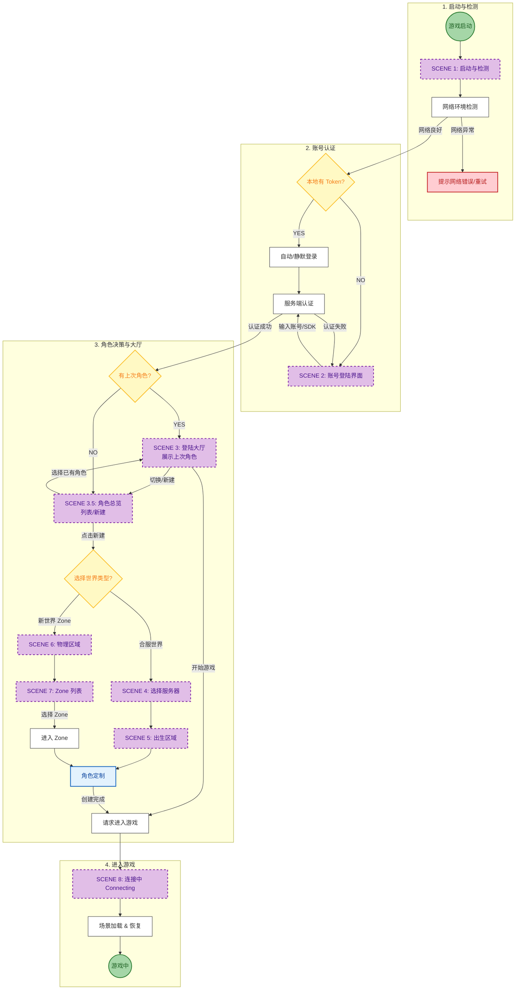

# 玩家进入游戏流程设计 (Login & Entry Flow Design)

本文档规划了玩家从启动游戏到正式进入游戏世界的完整交互流程，涵盖了SDK检测、网络优选、账号登录及多角色/多服务器的管理逻辑。

## 1. 整体流程图 (Overall Flowchart)

## 2. 详细流程说明 (Detailed Steps)

### 2.1 游戏启动与检测 (Startup & Check) [SCENE 1]
*   **游戏启动**: 客户端冷启动。
*   **SDK检测**:
    *   初始化渠道SDK（如Google Play, iOS GameCenter, 第三方发行SDK）。
    *   检查是否需要强制更新（Version Check）。
*   **网络检测**:
    *   Ping 列表中的 Login Server 网关，选择延迟最低的节点。
    *   若无网络连接，弹出系统弹窗提示重试。

### 2.2 账号登陆 (Account Login) [SCENE 2]
*   **自动登录**: 若本地存有有效 Token，尝试静默登录。
*   **手动登录**: 唤起 SDK 登录窗口或输入账号密码。
*   **获取数据**: 登录成功后，从服务器拉取该账号下的**最近登录角色**、**拥有角色的服务器列表**以及**推荐服务器列表**。

### 2.3 开始游戏/切换 (Lobby & Selection)
这是玩家进入游戏前的核心决策界面。

#### A. 默认展示 (Default View) [SCENE 3]
*   **已有角色玩家**: 界面中心展示**上次登出的角色**模型、ID、等级及所在服务器名称。
    *   **主按钮**: 【开始游戏】 (Enter Game)。
    *   **辅助按钮**: 【切换/总览】 (Switch / All Roles) - 进入角色总览界面，可切换其他角色或创建新角色。
    *   **其他**: 【切换账号】 (Switch Account)。
*   **新玩家**: 直接进入角色总览界面 (默认显示新建角色引导)。

#### B. 角色总览与新建 (Role Overview & New Character) [SCENE 3.5]
*   **角色总览**: 展示该账号下的所有角色列表。
*   **新建角色**: 点击 [+] 号进入新角色创建流程，面临两个世界选择：
    1.  **Option 1 (Merged Server)**: 加入已合服的成熟世界 (Server [SCENE 4] -> Region [SCENE 5]) -> **进入角色定制**。
    2.  **Option 2 (New Zone)**: 加入未合服的新世界 (Region [SCENE 6] -> Zone [SCENE 7]) -> **进入角色定制**。

### 2.4 角色定制与进入游戏 (Character Creation & Entry)
进入游戏流程分为两条独立的逻辑通道：

*   **TRACK 1: NEW JOURNEY (新角色)**
    *   **流程**: 连接服务器 (Connect [SCENE 8]) -> 角色定制 (Customize) -> 出生在新手村 (Spawn)。
    *   **描述**: 玩家选择好服务器/Zone后，系统建立连接，进入捏脸界面，完成后出生在新手村。

*   **TRACK 2: CONTINUE JOURNEY (老角色)**
    *   **流程**: 大厅直接开始 (Start) -> 资源加载与连接 (Connect [SCENE 8]) -> 恢复至原场景 (Restore)。
    *   **描述**: 玩家在大厅点击开始游戏，系统直接连接上次下线的服务器/Zone，并恢复玩家位置。

## 3. 异常处理 (Exception Handling)

| 异常场景 | 处理逻辑 |
| :--- | :--- |
| **SDK 初始化失败** | 弹窗提示“组件初始化失败”，禁止进入下一步，提供退出或重试按钮。 |
| **网络超时** | 在登录或连接阶段超过 10s 无响应，提示“连接服务器超时，请检查网络”。 |
| **服务器维护** | 在选择服务器或点击开始游戏时，若目标服处于维护状态，弹窗显示维护公告及预计开服时间。 |
| **排队等待** | 若目标服务器负载过高，弹出排队窗口，显示当前排队位置及预计等待时间。 |
| **版本不兼容** | 登录前检测客户端版本，若低于服务器要求，强制引导至应用商店更新。 |
