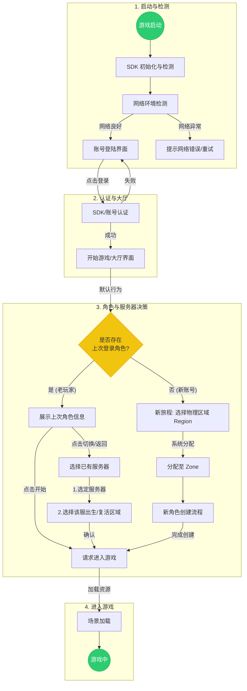

# 玩家进入游戏流程设计 (Login & Entry Flow Design)

本文档规划了玩家从启动游戏到正式进入游戏世界的完整交互流程，涵盖了SDK检测、网络优选、账号登录及多角色/多服务器的管理逻辑。

## 1. 整体流程图 (Overall Flowchart)

## 2. 详细流程说明 (Detailed Steps)

### 2.1 游戏启动与检测 (Startup & Check)
*   **游戏启动**: 客户端冷启动。
*   **SDK检测**:
    *   初始化渠道SDK（如Google Play, iOS GameCenter, 第三方发行SDK）。
    *   检查是否需要强制更新（Version Check）。
*   **网络检测**:
    *   Ping 列表中的 Login Server 网关，选择延迟最低的节点。
    *   若无网络连接，弹出系统弹窗提示重试。

### 2.2 账号登陆 (Account Login)
*   **自动登录**: 若本地存有有效 Token，尝试静默登录。
*   **手动登录**: 唤起 SDK 登录窗口或输入账号密码。
*   **获取数据**: 登录成功后，从服务器拉取该账号下的**最近登录角色**、**拥有角色的服务器列表**以及**推荐服务器列表**。

### 2.3 开始游戏/切换 (Lobby & Selection)
这是玩家进入游戏前的核心决策界面。

#### A. 默认展示 (Default View)
*   **已有角色玩家**: 界面中心展示**上次登出的角色**模型、ID、等级及所在服务器名称。
    *   **主按钮**: 【开始游戏】 (Enter Game)。
    *   **辅助按钮**: 【切换服务器】 (Switch Server)、【切换账号】 (Switch Account)。
*   **新玩家**: 直接进入服务器选择/推荐界面。

#### B. 选服流程 (Server Selection - Scheme 2)
> 参考文档: [Scheme 2 Detailed Design](scheme2_detailed_design.md)

根据 **Scheme 2** 的世界架构，选服流程分为两种截然不同的场景：

1.  **新玩家旅程 (New Journey)**:
    *   **交互**: 展示平行四边形世界地图 (World Map)，地图被划分为 A/B/C/D 四个物理区域。
    *   **逻辑**: 玩家选择物理区域 (Region)。
    *   **结果**: 系统根据该区域的负载情况，自动将玩家分配至某个 Zone (如 Zone 1001 或 1001-A)。
    *   **图示**: 仅展示地图与区域拥挤度，无传统服务器列表。

2.  **老玩家回归 (Existing World)**:
    *   **Step 1 选择服务器**: 在列表中选择已拥有角色的服务器 (Server)。
    *   **Step 2 选择区域**: 进入该服务器的世界地图，选择出生/复活区域 (Region)。
    *   **目的**: 允许老玩家定向回归特定服务器并选择战略位置。

#### C. 切换登陆角色 (Switch Role)
*   在选定服务器后，若该服有多个角色（通常通过合并服务器产生，或者游戏允许多角色），展示角色列表供选择。
*   若该服无角色，则直接进入**新角色创建流程**。

### 2.4 新角色流程 (New Character Flow)
当玩家选择了一个**没有角色**的服务器，或在已有服选择**新建角色**时触发：
1.  **选择服务器**: (如果是从服务器列表进入则已选定)。
2.  **创建角色**: 输入昵称、选择性别/外貌（如有）。
3.  **进入游戏**: 完成创建后，自动触发进入游戏逻辑。

### 2.5 进入游戏 (Enter Game)
*   客户端向 Game Server 发起连接请求。
*   同步用户数据、背包数据、场景数据。
*   展示 Loading 界面。
*   Loading 结束，渲染场景，玩家控制权移交，进入 **游戏中** 状态。

## 3. 异常处理 (Exception Handling)

| 异常场景 | 处理逻辑 |
| :--- | :--- |
| **SDK 初始化失败** | 弹窗提示“组件初始化失败”，禁止进入下一步，提供退出或重试按钮。 |
| **网络超时** | 在登录或连接阶段超过 10s 无响应，提示“连接服务器超时，请检查网络”。 |
| **服务器维护** | 在选择服务器或点击开始游戏时，若目标服处于维护状态，弹窗显示维护公告及预计开服时间。 |
| **排队等待** | 若目标服务器负载过高，弹出排队窗口，显示当前排队位置及预计等待时间。 |
| **版本不兼容** | 登录前检测客户端版本，若低于服务器要求，强制引导至应用商店更新。 |
