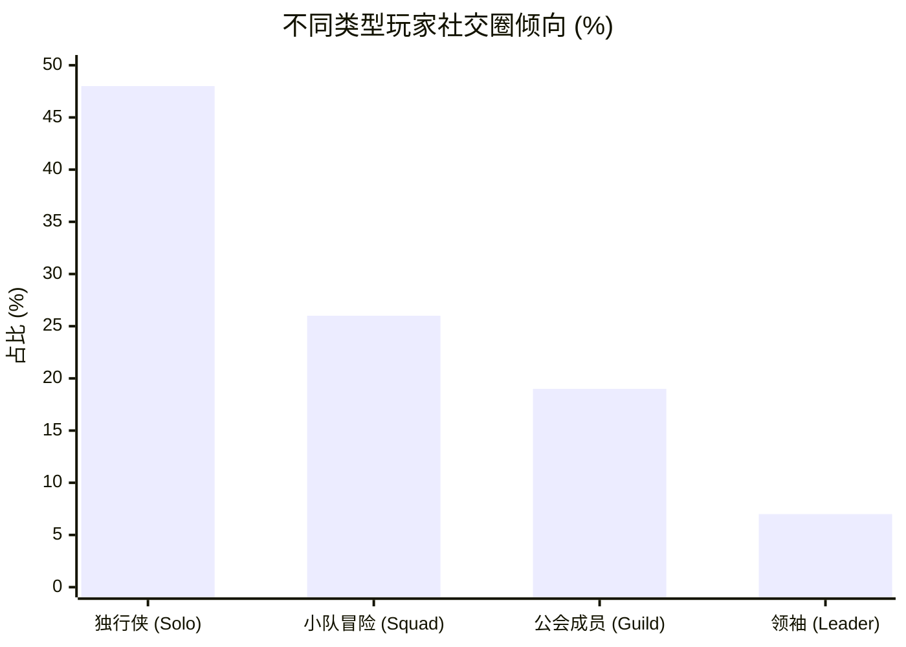
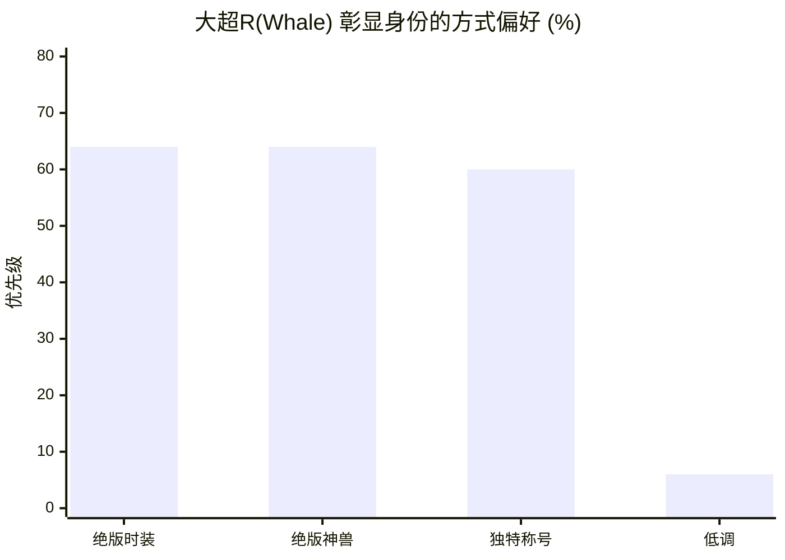
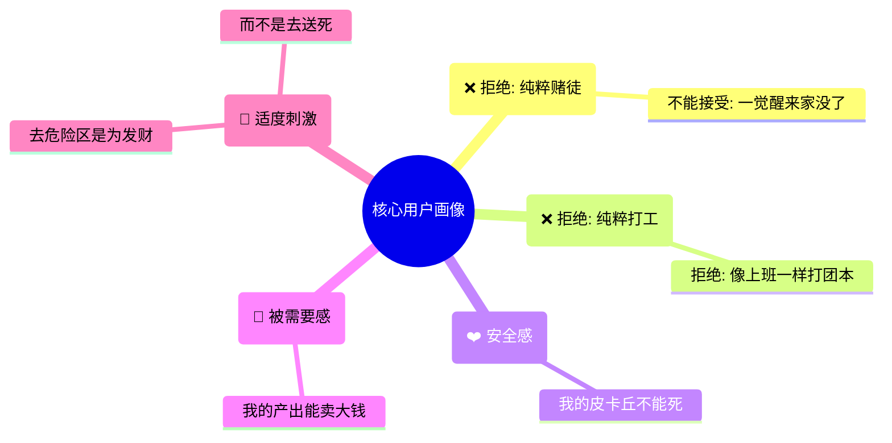

# 7日社交框架方案 (7-Day Social Framework Scheme)

## 1. 背景与目的：

通过前置的经济会议定论，已经确立以 “杖剑传说” 为核心结构蓝本，构建适合 美国市场 的 GVE（PVE合作）社交生态，并明确了如何将“宝可梦 IP 体验”融入该架构的落地路径。

### 1.1 🎯 背景的会议结论
1.  **架构定调**: **弃用 SLG (三谋) 与 Top Heroes 架构**，全面对标 “杖剑传说” 的数值成长与地图解锁结构。
2.  **核心改动**: 以 “宝可梦收集度 (Collection)” 替代单纯战力，作为驱动社交行为的核心动力。
3.  **社交模式**: 确立以 GVE (副本合作) 为核心，打造 **“大R带队 (Carry) + 互利共生”** 的良性社交生态。

#### 1. 核心循环改造：从“战力锁”到“图鉴锁”
*   **原版逻辑**: 地图区域由“战力 (CP)”硬锁卡住，战力不够无法进入。
*   **适配方案**: **参考《宝可梦传说：阿尔宙斯》**。
    *   将冰冷的“战力数值锁”替换为 **“图鉴收集锁”**。
    *   **逻辑**: 玩家为了解锁下一个区域（如火山区），必须先在当前区域（如森林区）完成足够的 **收集进度**（抓捕数量/进化图鉴）。
    *   **优势**: 这既保留了“杖剑传说”的强验证结构，又符合宝可梦玩家“Gotta Catch 'Em All”的原始驱动力。

#### 2. 社交生态构建：GVE “带飞模式”
*   **核心痛点**: 如何让大R爽，同时让普通玩家留存？
*   **解决方案**: 设计 **高难度组队副本**。
    *   **数值压制**: 大R在副本中的输出占比可达 **90%**（绝对主角）。
    *   **评级机制**: 普通玩家自己组队只能拿低评级（D/C级）奖励；跟着大R打能拿高评级（S级）奖励。
    *   **互利闭环**: 大R获得社交崇拜、友情点和带人成就；普通玩家获得核心成长资源。这种“Pay-to-Help”模式比“Pay-to-Win”更易被欧美玩家接受。

#### 3. 地图与进程：非线性分布，线性解锁
*   **挑战**: “杖剑传说”的推图是线性的，但宝可梦生态是按地貌（Biome）分布的。
*   **落地规划**:
    *   **分线汇聚结构**: 采用多出生点（不同地貌/属性） -> 最终汇聚于中心高地（High Level Area）。
    *   **传送门机制**: 利用传送点（类似公交站）连接各区域，解决跑图枯燥问题。
    *   **体验目标**: 虽然物理空间是非线性的，但在 **数值解锁顺序** 上保持线性体验（Lv10区域 -> Lv20区域 -> Lv30区域），确保成长曲线可控。

### 1.2 用户调研 

基于2026-2最新的调研报告，我们的用户画像极其清晰且具有特殊性。

#### 1 核心数据与结论

*   **1. 玩家社交圈倾向 (Social Circle Preference)**:
    *   **泛化玩家**: 48% 是绝对的**独行侠 (Solo)**，仅 26% 接受小队冒险。
    *   **硬核玩家**: 32% 喜欢加入公会大家庭，26% 享受成为领袖/管理者。
    *   **结论**: 泛化用户的社交起点必须是**极低门槛的弱连接**，不能上来就推强公会。

*   **2. 野外PVP风险容忍度 (Wild PVP Risk)**:
    *   **泛化玩家**: 仅 25% 接受野外被攻击，30% 明确抵触。
    *   **硬核玩家**: 72% 享受野外风险 (Accept)，仅 12% 抵触。
    *   **区域差异**: 美国玩家 (60% Accept) 显著高于韩国玩家 (33% Accept)。

```mermaid
xychart-beta
    title "野外PVP风险容忍度: 接受 vs 抵触 (%)"
    x-axis ["总体", "硬核", "核心", "泛化"]
    y-axis "占比 (%)" 0 --> 80
    bar [51, 72, 60, 25]
    bar [21, 12, 19, 30]
```

*   **3. GVE 参与意愿 (GVE Preference)**:
    *   **总体趋势**: 62% 玩家喜欢为了强力宠物组队 (20人副本)。
    *   **泛化玩家**: 意愿最低 (44% 喜欢)，且抵触比例最高 (15%)。
    *   **硬核/核心**: 意愿极高 (>70%)，是 GVE 的主力军。

```mermaid
xychart-beta
    title "20人GVE副本参与意愿: 喜欢 vs 抵触 (%)"
    x-axis ["总体", "硬核", "核心", "泛化"]
    y-axis "占比 (%)" 0 --> 80
    bar [62, 71, 71, 44]
    bar [10, 5, 9, 15]
```

*   **4. 大R炫耀需求 (Whale Showing Off)**:
    *   **大超R (Whales)**: **绝版时装 (64%)** 与 **绝版神兽 (64%)** 并列第一。
    *   **总体对比 (vs Total)**: 总体用户对 **绝版神兽 (60%)** 的关注度高于 **绝版时装 (51%)**，大R则两者兼顾且比例更高。
    *   **称号需求**: 独特的称号 (60%) 也是大R极其看重的展示途径。
    *   **低调需求**: 只有 6% 的大超R不希望别人看出实力。

#### 2 我们的用户是谁？

> **总结**: 我们的用户是 **"带着爱宠的冒险者"**。他们寻求的是**有底线的冒险**（适度刺激），而非**无底线的杀戮**（纯粹SLG）。他们的核心驱动力是**情感链接**（宠物）与**经济价值**（交易），而非单纯的数值碾压。

### 1.3 设计目的
梳理 7 日版本中核心社交层级的关系与定义，重点回答以下争议点：
*   **小队社交层级 (Squad Social Layer)**:
    *   **现状**: 目前 7 日版本中缺失明确的“小队”层级。
    *   **议题**: 是否需要增加小队层级？如果增加，配套的系统玩法是什么？
    *   **托管归属**: 同步托管（在线）与异步托管（离线）是否应下沉至小队维度？
*   **联盟系统定义 (Alliance System Definition)**:
    *   **现状 (Scheme B - Hive)**: 联盟与成员脱节，属于“小盟社群”。各类型联盟共存，玩家可随意走动，无深度绑定。
    *   **仗剑模式 (Scheme A - Home)**: “大盟集群”结构。拥有深坑的联盟科技树，玩家与联盟深度绑定（沉没成本高）。
    *   **议题**: 是否需要对目前定义的联盟系统进行修改？是坚持蜂巢模式，还是转向仗剑的强绑定模式？

---

## 2. 参考分析总结 (Reference Analysis Summary)

> **详细数据支持**：请参阅 [Beagle Social Analysis Report](file:///d:\charlie\social\publish\Beagle_Social_Analysis_Report.html) 以获取完整的竞品数据图表与交互式分析。

由于经济上已经确认了一套整体框架，我们会优先还原 **仗剑传说 (Sword Chronicles)** —— 这个唯一的 MMO 手游成功案例（将放置与 MMO 完美结合），作为 7 日版本的核心参考对象。

### 2.1 仗剑传说深度分析 (Deep Dive: Sword Chronicles)

> **💡 核心逻辑**: **多样化的小队协作与挂机成长 (Managed Cooperation)**。
> *   **低压强绑定**: 组满 4 人即可（高必要性），但战斗全自动（低压力）。
> *   **离线共享**: 即使下线，角色仍可被调用或挂机产出。社交不强求"同时在线"。

#### 1. Who (社交对象与流转)

**👥 核心单位: 固定小队 (Fixed Squad)**
基于长期数值绑定的共生关系。

**🛡️ 小队体系深度分析 (Squad System Deep Dive)**

| 社交形态 | 玩法 | 说明 |
| :--- | :--- | :--- |
| **渗透社交** | **组队副本 (Team Dungeons)**   | 虽为固定队，但鼓励"动态助战"引入外部大腿。 |
| **隔离社交** | **圣兽试炼 (Sacred Beast)**   | 高难数值验证，强调极致配合，无干扰。 |
| **半渗透** | **大地图探索 (Exploration)**   | 小队战术配合 vs 大世界人海战术。 |
| **隔离社交** | **自由对决 (Free Duel)**   | 纯粹的封闭式竞技场对抗。 |

**🤝 渗透形式: "大佬带飞" (Carry Culture)**
当玩家遇到困难时，系统鼓励**跨队求助**（随机匹配/跨服）。这是打破封闭性、让"大佬"价值溢出的窗口。

**🏛️ 联盟体系深度分析 (Alliance System Deep Dive)**

*   **核心循环**: **"联盟挂机" (Alliance Idle) + "反哺机制" (Feedback Loop)**。
*   **定位**: **"累积成长的家" (Cumulative Home)**。联盟不仅仅是聊天室，更是存放玩家"沉没成本"（科技/建筑等级）的资产库。

| 功能模块 | 界面展示 | 核心机制 |
| :--- | :--- | :--- |
| **联盟主页** (核心管理) |  | **联盟挂机**: 成员挂机产出资源。 **信息展示**: 核心数据一目了然。 |
| **联盟总览** (成员统计) |  | **资源统计**: 监控全盟资源流向。 **成员状态**: 活跃度与贡献值统计。 |
| **联盟建筑** (升级体系) |  | **建筑升级**: 资源用于升级联盟建筑（如训练场、祭坛），解锁更多功能位。 |
| **联盟科技** (全员反哺) |  | **联盟科技**: 消耗资源研究科技，提供全员 Buff（如挂机经验+10%）和每日礼包。 |

**💰 联盟付费层级结构 (Alliance Payment Tier Structure)**

*   **大R/中R (Whales/Dolphins - 25%)**: 担任**队长/车头**。
    *   **职责**: 队伍的大脑，负责调整技能顺序、宠物搭配。
    *   **体验**: **掌控感**。
*   **小R/零氪 (Minnows/F2P - 75%)**: 担任**队员/挂件**。
    *   **职责**: 负责上线收菜、强化装备。
    *   **体验**: **躺赢感**。
#### 2. Why (社交动机)
*   **🧱 推图/开荒 (Progression)**: `缺一不可`
    *   单人无法突破数值门槛，强制组队。
*   **🌾 挂机/收菜 (Efficiency)**: `极致效率`
    *   为了 +50% 掉落率与经验加成。
*   **🏆 排名/竞速 (Social Status)**: `阶层满足`
    *   队长体验掌控(Carry)，队员体验躺赢(Leech)。

#### 3. What & Where (内容与平台)
*   **📝 内容 (What)**:
    *   **一键抄作业**: 最低门槛的"教学相长"。
    *   **求组队/分享**: 核心交互，链接大佬与萌新。
*   **📍 场景 (Where)**:
    *   **玩家面板/战报**: 点击查看的那一刻社交发生。
    *   **游戏内 IM**: 沟通与协调。

#### 4. How (核心策略)
*   **🔗 利益捆绑 (Interest Binding)**:
    *   **💤 离线收益**: 离线也能为联盟/队友提供产出。
    *   **🚌 日常开车**: 大佬带队刷材料，互利共生。
    *   **🤖 异步助战**: 拉取离线镜像，属性达标开箱。

#### 2.2 核心体验五维对比 (Core Experience Radar Comparison)

| 维度 (Dimensions) | Sword Chronicles (Beagle Target) | ROK (SLG) | Albion (MMO) |
| :--- | :--- | :--- | :--- |
| **社交压力** (Social Pressure) | **20 (极低)** | 90 (极高) | 80 (高) |
| **操作门槛** (Skill Floor) | **10 (有手就行)** | 60 (中等) | 90 (硬核) |
| **义务感** (Obligation) | **60 (中等)** | 90 (打卡上班) | 40 (自由) |
| **自由度** (Freedom) | **40 (线性)** | 50 (半开放) | 100 (沙盒) |
| **利益绑定** (Interest Binding) | **90 (强绑定)** | 80 (强绑定) | 50 (弱绑定) |

**🎯 Sword Chronicles (Beagle 目标)**
> **核心体验**: 极致的**低操作、高绑定**。通过强数值绑定（缺一不可）维持社交，但把操作压力降到最低（全自动/托管）。

*   **表现 (Performance)**: `低 (Low)` - 数值游戏，自动战斗屏蔽了操作失误。
*   **义务 (Obligation)**: `中 (Medium)` - 需要定期上线收菜（Keep Active），否则会因战力掉队被"优化"。
*   **沟通 (Communication)**: `低 (Async)` - 异步交流为主。
*   **惩罚 (Penalty)**: `低 (Low)` - 卡关无实质损失，可无限重试。
*   **环境 (Environment)**: `互助 (Supportive)` - 基于互利的长期伙伴关系。

---

**🆚 竞品对比**
*   **ROK (SLG)**: **高压、高义务**。社交建立在生存恐惧（不抱团就被打）之上，心累。
*   **Albion (MMO)**: **高自由、高门槛**。虽然自由，但对操作要求极高（全手动无锁定），不适合泛用户。

### 2.3 竞品社交层级深度横向对比 (Comparative Analysis: Squad vs. Alliance)

由于明确对标的仗剑传说中，小队层级是其核心社交单位
所以我们将对各类参考游戏拆分为 **小队 (Squad)** 和 **联盟 (Alliance)** 两个维度，分别分析其典型玩法、目的与体验，以辅助判断beagle中这两个层级那些部分是不可或缺的，哪些是可以后续扩展

#### 📋 列表 A: 小队层级玩法分析 (Squad Level Analysis)

| Game (游戏) | Gameplay (玩法) | Size (人数) | Purpose (目的) | Social Nature (社交性质) | Social Form (社交形态) | Experience (体验) |
| :--- | :--- | :--- | :--- | :--- | :--- | :--- |
| **Sword Chronicles** (仗剑传说) | **Tier 1**: 组队副本 (Team Dungeons) (动态助战，离线托管) | 4人 (固定) | **资源/进度** 高难攻坚，缺一不可 | **熟人社交** (长期绑定) | **渗透社交** (动态助战，跨队支援) | **安稳** 躺赢与带飞，低压力 |
| **Sword Chronicles** (Tier 1 - Assist) | **异步离线助战 (Async Assist)** (拉取镜像，属性宝箱) | 2-5人 (弹性) | **降低门槛/强制绑定** 属性达标开启 | **熟人社交** (利益强绑定) | **渗透社交** (镜像助战) | **被需要** 离线也能做贡献 |
| **Sword Chronicles** (Tier 2 - Challenge) | **圣兽试炼 (Sacred Beast)** (DPS 验证，高难副本) | 6人 (组队) | **战力验证** 突破数值瓶颈 | **熟人社交** (长期绑定) | **隔离社交** (输出不够直接狂暴) | **高压** 一人划水全队不过 |
| **Sword Chronicles** (Tier 2 - World) | **大地图探索 (Exploration)** (世界 Boss/活动) | 9人 (团) | **抢夺资源** 世界事件与 Boss | **熟人社交** (临时组队但长期绑定) | **半渗透+隔离社交** (人多势众但核心配合) | **热闹** 无序的快乐 |
| **Sword Chronicles** (Tier 2 - PVP) | **自由对决 (Free Duel)** (PVP 测试场) | 8人 (混战) | **战力测试** 大佬 1vN 秀场 | **熟人社交** (不服就干) | **隔离社交** (割草与被割草) | **爽快** 纯粹的暴力美学 |
| **Rise of Kingdoms** (ROK) - Tier 1 | **赛萝丽危机 (Ceroli)** (5人副本，躲技能) | 5人 (匹配) | **拿奖励** 获取特定副本代币 | **生人社交** (随机匹配，打完即散) | **隔离社交** (独立副本实例) | **刺激** 强调瞬时操作配合 |
| **Rise of Kingdoms** (ROK) - Tier 2 | **埃及之战 (Ark)** (30人战场，抢灵柩) | 30人 (选拔) | **抢灵柩/竞技** 获取战场积分与排名 | **熟人社交** (盟内选拔，语音指挥) | **隔离社交** (独立战场实例) | **荣耀** 强调战术执行与团队配合 |
| **World of Warcraft** (魔兽世界) - Tier 1 | **大秘境 (Mythic+)** (地下城竞速) | 5人 (战法牧) | **刷装备** 获取高装等掉落 | **混杂社交** (集合石野队/车队) | **隔离社交** (独立副本实例) | **高压** 一人犯错全队背锅 |
| **World of Warcraft** (魔兽世界) - Tier 2 | **固定团 (Raid Team)** (史诗团本攻坚) | 20人 (固定) | **进度攻坚** 服务器首杀/名人堂 | **熟人社交** (同事般的固定关系) | **隔离社交** (独立副本实例) | **成就感** 长期磨合后的集体胜利 |
| **Albion Online**  - Tier 1 | **2v2 / 5v5 Hellgate** (炼狱之门竞技) | 2-5人 (固定) | **竞技/赌博** 赢者通吃，输者全掉 | **熟人社交** (极高信任门槛) | **隔离/半渗透** (独立空间但有入侵) | **惊悚** 高风险PVP |
| **Albion Online**  - Tier 2 | **抓人队 (Gank Squad)** (黑区游走蹲人) | 10-20人 (灵活) | **杀人越货** 掠夺路人装备 | **熟人社交** (分赃需要信任) | **渗透社交** (野外开放，随时遇敌) | **猎杀** 狼群战术的快感 |
| **Three Kingdoms** (三谋/三国志) - Tier 1 | **铺路小组** (邻居互助) | 2-3人 (邻居) | **互借地块** 打高级地，连地铺路 | **生人转熟人** (地缘 -> 战友) | **渗透社交** (大地图无缝交互) | **便捷** 基于地理位置的互助 |
| **Three Kingdoms** (三谋/三国志) - Tier 2 | **作战团 (Legion)** (局部战场突破) | 30-50人 (编制) | **局部突破** 集火攻坚，撕开防线 | **熟人/战友** (听指挥) | **渗透社交** (大地图无缝交互) | **执行** 指哪打哪的纪律性 |

#### 📋 列表 B: 联盟层级玩法分析 (Alliance Level Analysis)

| Game (游戏) | Gameplay (玩法) | Size (人数) | Purpose (目的) | Social Nature (社交性质) | Social Form (社交形态) | Experience (体验) |
| :--- | :--- | :--- | :--- | :--- | :--- | :--- |
| **Sword Chronicles** (仗剑传说) - Tier 1 | **家族挂机 (Family Idle)** (提供被动Buff/资源) | 60人 (全员) | **资源产出** 存放沉没成本(科技) | **利益集合体** (搭伙过日子) | **隔离社交** (仅聊天/捐献) | **归属** 成长的港湾，无需强交流 |
| **Sword Chronicles** (仗剑传说) - Tier 2 | **跨服联盟战 (GvG)** (全服顶尖对抗) | 60人 (核心) | **排名荣誉** 争夺服务器第一 | **战斗机器** (战力硬门槛) | **隔离社交** (独立战场实例) | **荣耀** 集体排名的虚荣心 |
| **Rise of Kingdoms** (ROK) - Tier 1 | **联盟领土 (Territory)** (采集加成/打城寨) | ~100人 (盟友) | **发育互助** 提供保护伞与Buff | **互助组织** (点帮助/集结) | **渗透社交** (大地图接壤) | **便利** 抱大腿的安全感 |
| **Rise of Kingdoms** (ROK) - Tier 2 | **KvK (王国光影)** (跨服国战，关卡争夺) | ~150人+ (多盟联合) | **版图征服** 争夺最高荣誉 | **战争机器** (强管理/执行) | **渗透社交** (外交博弈/背刺) | **宏大** 人海战术，大数值碾压 |
| **World of Warcraft** (魔兽世界) - Tier 1 | **公会社区 (Social)** (聊天/修装备/小号) | 100-1000人 (随意) | **后勤/容器** 提供便利与人员储备 | **泛熟人** (平台化) | **隔离社交** (频道聊天) | **轻松** 上线有人说话 |
| **World of Warcraft** (魔兽世界) - Tier 2 | **进度团 (Progression)** (史诗团本开荒) | 20-30人 (精锐) | **顶级进度** 服务器首杀/名人堂 | **职业化** (DKP/考勤) | **隔离社交** (独立副本) | **史诗** 大型组织的荣誉感 |
| **Albion Online**  - Tier 1 | **领地/地堡 (Hideout)** (黑区安全点/制造) | 数百人 (公会) | **后勤/安全** 提供黑区立足点 | **利益共同体** (税收换保护) | **渗透社交** (领地巡逻) | **安稳** 危险世界的避风港 |
| **Albion Online**  - Tier 2 | **ZvZ (阵营战)** (大规模军团战) | 数百人 (联盟) | **区域垄断** 控制资源点与主权 | **政治机器** (强制征召) | **渗透社交** (全域对抗) | **混乱** 屏幕被技能填满 |
| **Three Kingdoms** (三谋/三国志) - Tier 1 | **攻城 (City Siege)** (打NPC城池) | 100-200人 (全盟) | **发育/扩充** 提升资源产量上限 | **集体行动** (打卡上班) | **渗透社交** (行军路线) | **积累** 看着领土变大的满足感 |
| **Three Kingdoms** (三谋/三国志) - Tier 2 | **州战 (State War)** (玩家对抗/争夺洛阳) | 200-300人 (全盟) | **赛季霸业** 全服统一 | **军队士兵** (家国情怀) | **渗透社交** (全图推演) | **使命** 执行力至上 |

## 3. 7日下的社交生态构建 (Social Ecology in the 7-Day Version)

基于 7 日版本的验证目标，我们重新梳理了三种可行的社交生态路径（CP）。

### CP1: 完全还原仗剑 (Full Sword Chronicles Model)
*   **参考游戏 (Reference)**: *Sword Chronicles (仗剑传说)*
*   **社交主体**: **固定小队 (4人利益共同体)** + **联盟 (家庭制)**。

#### 1. 小队层级 (Squad Level)
> 对照表格中仗剑的小队功能进行取舍与适配。

| 玩法 (Gameplay) | 设计目的 (Design Purpose) | 社交性质 (Social Nature) | 核心机制 (Key Mechanics) |
| :--- | :--- | :--- | :--- |
| **组队副本** P0 (Team Dungeons) | **核心PVE/数值验证** 缺一不可的强绑定 | **熟人社交** (渗透) | 必须包含动态助战与离线托管机制，确保“随时能打”。 |
| **异步离线助战** P1 (Async Assist) | **社交破冰** 降低组队时间门槛 | **熟人社交** (利益强绑定) | 允许拉取离线队友镜像协助战斗。 |
| **圣兽试炼** P2 (Sacred Beast) | **高难验证** (后期拓展) | **熟人社交** (隔离) | **[暂缓]** 7日版本暂不实装。 |
| **大地图探索** P1 (Exploration) | **资源争夺** 小队为探索单位 | **半渗透社交** (小队配合) | 严格限制为 4 人，确保小队是探索的基本单位。 |
| **自由对决** P2 (Free Duel) | **战力测试** PVP | **隔离社交** (封闭对抗) | 允许 4 人小队一起进行 PVE 或 PVP。 |

**🔴 边界条件处理 (Boundary Condition: PVP Zones)**
*   **问题**: Beagle 存在 PVP 地块，如何处理小队与联盟的关系？
*   **机制**: **自动脱离小队逻辑，继承联盟关系**。
    *   当玩家进入 PVP 争夺地块时，系统的“友军判定”逻辑从 `SquadID` 升级为 `AllianceID`。
    *   **参考**: **Albion Online (ZvZ)** 或 **World of Warcraft (Faction Mode)**。在大型 PVP 区域，联盟/公会标签优先级高于小队。同一联盟的不同小队成员互为绿名（不可攻击），不同联盟成员为红名。这避免了“同盟内战”的尴尬，同时保留了小队作为战术执行单元（如治疗小队）的功能。

    <svg viewBox="0 0 800 300">
        <!-- Definitions -->
        <defs>
            <marker id="arrow-cp1" markerWidth="10" markerHeight="10" refX="9" refY="3" orient="auto" markerUnits="strokeWidth">
                <path d="M0,0 L0,6 L9,3 z" fill="#333" />
            </marker>
        </defs>

        <!-- Left: Safe Zone -->
        <g transform="translate(50, 50)">
            <text x="100" y="-20" class="sketch-title">安全区 (Safe Zone)</text>
            <text x="100" y="220" class="sketch-text">判定: SquadID</text>
            
            <!-- Squad A -->
            <rect x="0" y="0" width="90" height="180" rx="10" class="sketch-fill" style="fill:#e3f2fd;" />
            <text x="45" y="25" class="sketch-text" style="font-size:14px; font-weight:bold;">Squad A</text>
            <circle cx="25" cy="60" r="5" class="sketch-line" fill="#2196f3"/>
            <circle cx="65" cy="60" r="5" class="sketch-line" fill="#2196f3"/>
            <circle cx="25" cy="100" r="5" class="sketch-line" fill="#2196f3"/>
            <circle cx="65" cy="100" r="5" class="sketch-line" fill="#2196f3"/>

            <!-- Squad B -->
            <rect x="110" y="0" width="90" height="180" rx="10" class="sketch-fill" style="fill:#e3f2fd;" />
            <text x="155" y="25" class="sketch-text" style="font-size:14px; font-weight:bold;">Squad B</text>
            <circle cx="135" cy="60" r="5" class="sketch-line" fill="#2196f3"/>
            <circle cx="175" cy="60" r="5" class="sketch-line" fill="#2196f3"/>
            <circle cx="135" cy="100" r="5" class="sketch-line" fill="#2196f3"/>
            <circle cx="175" cy="100" r="5" class="sketch-line" fill="#2196f3"/>
            
            <!-- Separation Line -->
            <path d="M100,40 L100,160" class="sketch-line" style="stroke-dasharray: 5,5; stroke-width: 1.5; opacity: 0.5;" />
            <text x="100" y="100" class="sketch-text" style="fill:#666; font-size:12px; background:white;">Neutral</text>
        </g>

        <!-- Arrow Transition -->
        <g transform="translate(300, 130)">
            <path d="M0,0 L150,0" class="sketch-line" style="marker-end: url(#arrow-cp1); stroke-width: 4;" />
            <text x="75" y="-15" class="sketch-text" style="font-weight:bold;">进入 PVP 区域</text>
        </g>

        <!-- Right: PVP Zone -->
        <g transform="translate(500, 50)">
            <text x="125" y="-20" class="sketch-title">PVP 区域 (War Zone)</text>
            <text x="125" y="220" class="sketch-text">判定: AllianceID (Single Unit)</text>

            <!-- Alliance Alpha Container (Now acting as one big Squad) -->
            <rect x="0" y="0" width="220" height="180" rx="15" class="sketch-fill" style="fill:#e8f5e9;" />
            <text x="110" y="25" class="sketch-text" style="fill:#2e7d32; font-weight:bold;">Alliance Alpha (Big Squad)</text>
            
            <!-- Unified Members (No Squad boundaries) -->
            <g fill="#4caf50">
                <!-- Row 1 -->
                <circle cx="40" cy="60" r="6" class="sketch-line" />
                <circle cx="80" cy="60" r="6" class="sketch-line" />
                <circle cx="120" cy="60" r="6" class="sketch-line" />
                <circle cx="160" cy="60" r="6" class="sketch-line" />
                <!-- Row 2 -->
                <circle cx="40" cy="100" r="6" class="sketch-line" />
                <circle cx="80" cy="100" r="6" class="sketch-line" />
                <circle cx="120" cy="100" r="6" class="sketch-line" />
                <circle cx="160" cy="100" r="6" class="sketch-line" />
            </g>
            
            <text x="110" y="140" class="sketch-text" style="font-size:14px; font-style:italic;">Squads Dissolved</text>
            <text x="110" y="160" class="sketch-text" style="font-size:14px; font-style:italic;">All Allies = One Unit</text>

            <!-- Enemy -->
            <g transform="translate(240, 50)">
                <rect x="0" y="0" width="60" height="100" rx="5" class="sketch-fill" style="fill:#ffebee;" />
                <text x="30" y="25" class="sketch-text" style="font-size:12px; fill:#c62828;">Enemy</text>
                <circle cx="30" cy="50" r="5" class="sketch-line" fill="#f44336"/>
            </g>
            
            <!-- Attack Line -->
            <path d="M220,90 L240,90" class="sketch-line" style="stroke: #c62828; marker-end: url(#arrow-cp1);" />
        </g>
    </svg>

#### 2. 联盟层级 (Alliance Level)
> 对照表格中仗剑的联盟功能。

| 玩法 (Gameplay) | 设计目的 (Design Purpose) | 社交性质 (Social Nature) | 核心机制 (Key Mechanics) |
| :--- | :--- | :--- | :--- |
| **家族挂机** P0 (Idle) | **利益共同体** 维持基本留存与归属 | **利益集合体** (隔离) | 提供累计产出给联盟单位，维持基本的“利益共同体”感觉。 |
| **跨服联盟战** P2 (GvG) | **长线GvG** 顶级对抗 | **战斗机器** (隔离) | **[不做]** 7日版本暂不考虑。 |
| **大地图 GVE** P1 (Map GVE) | **高级追求** 消耗过剩数值 | **熟人社交** (团本) | 需完成地块争夺后开启，对标 CoD / WoW 团本。 |
| **大地图 GvG** P1 (Map GvG) | **地块争夺** 服务器荣誉 | **战斗机器** (隔离) | 在单独的 PVP 地块上，以联盟为单位进行地块争夺与对抗。 |

#### 3. 社交的渐进聚合关系 (Social Progression)

    <svg viewBox="0 0 950 350">
        <!-- Time Axis -->
        <g transform="translate(50, 320)">
            <line x1="0" y1="0" x2="850" y2="0" class="sketch-line" style="stroke-width: 3;" />
            <path d="M840,-5 L850,0 L840,5" class="sketch-fill" fill="#333" />
            <text x="0" y="20" class="sketch-text">Day 1</text>
            <text x="350" y="20" class="sketch-text">Day 7</text>
            <text x="700" y="20" class="sketch-text">Day 30+</text>
        </g>

        <!-- Phase 1: Squad Formation (Day 1-3) -->
        <g transform="translate(50, 50)">
            <text x="80" y="-10" class="sketch-title">Step 1: 组建小队</text>
            
            <!-- Isolated Squads -->
            <g transform="translate(0, 40)">
                <rect x="0" y="0" width="70" height="100" rx="5" class="sketch-fill" style="fill:#e3f2fd;" />
                <text x="35" y="20" class="sketch-text" style="font-size:12px;">Squad A</text>
                <circle cx="20" cy="50" r="4" class="sketch-line" fill="#2196f3"/>
                <circle cx="50" cy="50" r="4" class="sketch-line" fill="#2196f3"/>
                <circle cx="20" cy="80" r="4" class="sketch-line" fill="#2196f3"/>
                <circle cx="50" cy="80" r="4" class="sketch-line" fill="#2196f3"/>
            </g>

            <g transform="translate(90, 40)">
                <rect x="0" y="0" width="70" height="100" rx="5" class="sketch-fill" style="fill:#e3f2fd;" />
                <text x="35" y="20" class="sketch-text" style="font-size:12px;">Squad B</text>
                <circle cx="20" cy="50" r="4" class="sketch-line" fill="#2196f3"/>
                <circle cx="50" cy="50" r="4" class="sketch-line" fill="#2196f3"/>
                <circle cx="20" cy="80" r="4" class="sketch-line" fill="#2196f3"/>
                <circle cx="50" cy="80" r="4" class="sketch-line" fill="#2196f3"/>
            </g>

            <text x="80" y="170" class="sketch-text" style="font-style:italic; font-size:14px;">"Self-Organized"</text>
        </g>

        <!-- Arrow 1-2 -->
        <path d="M220,100 Q250,100 280,100" class="sketch-line" style="marker-end: url(#arrow-cp1); stroke-dasharray: 5,5;" />
        <text x="250" y="90" class="sketch-text" style="font-size:12px;">Need Resources</text>

        <!-- Phase 2: Cellular Integration (Day 7) -->
        <g transform="translate(300, 50)">
            <text x="100" y="-10" class="sketch-title">Step 2: 小队入盟</text>
            
            <!-- Alliance Container -->
            <rect x="0" y="20" width="200" height="160" rx="15" class="sketch-line" style="fill:#f1f8e9; stroke-dasharray: 8,4;" />
            <text x="100" y="45" class="sketch-text" style="font-weight:bold; fill:#2e7d32;">ALLIANCE</text>

            <!-- Squads Inside -->
            <g transform="translate(20, 60)">
                <rect x="0" y="0" width="60" height="80" rx="5" class="sketch-fill" style="fill:#c8e6c9;" />
                <text x="30" y="15" class="sketch-text" style="font-size:10px;">Sq A</text>
                <circle cx="30" cy="45" r="3" class="sketch-line" fill="#4caf50"/>
            </g>
            <g transform="translate(120, 60)">
                <rect x="0" y="0" width="60" height="80" rx="5" class="sketch-fill" style="fill:#c8e6c9;" />
                <text x="30" y="15" class="sketch-text" style="font-size:10px;">Sq B</text>
                <circle cx="30" cy="45" r="3" class="sketch-line" fill="#4caf50"/>
            </g>
            
            <text x="100" y="200" class="sketch-text" style="font-style:italic; font-size:14px;">"Cellular Structure"</text>
        </g>

        <!-- Arrow 2-3 -->
        <path d="M510,100 Q540,100 570,100" class="sketch-line" style="marker-end: url(#arrow-cp1); stroke-dasharray: 5,5;" />
        <text x="540" y="90" class="sketch-text" style="font-size:12px;">Contribution</text>

        <!-- Phase 3: Alliance Support & Openness (Day 30+) -->
        <g transform="translate(580, 50)">
            <text x="140" y="-10" class="sketch-title">Step 3: 联盟反哺 & 外部渗透</text>
            
            <!-- Solid Alliance Container -->
            <rect x="0" y="20" width="200" height="160" rx="15" class="sketch-fill" style="fill:#dcedc8; stroke-width: 4;" />
            <text x="100" y="45" class="sketch-text" style="font-weight:bold; fill:#33691e;">STRONG ALLIANCE</text>

            <!-- Squads Inside -->
            <g transform="translate(20, 60)">
                <rect x="0" y="0" width="60" height="80" rx="5" class="sketch-fill" style="fill:#a5d6a7;" />
                <circle cx="30" cy="45" r="3" class="sketch-line" fill="#4caf50"/>
            </g>
            <g transform="translate(120, 60)">
                <rect x="0" y="0" width="60" height="80" rx="5" class="sketch-fill" style="fill:#a5d6a7;" />
                <circle cx="30" cy="45" r="3" class="sketch-line" fill="#4caf50"/>
            </g>

            <!-- Feedback Rain (Benefits) -->
            <g fill="#ffb300" stroke="#f57f17" stroke-width="1">
                <path d="M50,40 L60,50 L50,60 L40,50 Z" class="anim-float" /> <!-- Diamond -->
                <path d="M150,40 L160,50 L150,60 L140,50 Z" class="anim-float" style="animation-delay: 0.5s;" />
                <circle cx="100" cy="100" r="5" class="anim-float" style="animation-delay: 1s;" />
            </g>
            
            <!-- Cycling Arrows (Symbiosis) -->
            <path d="M100,160 Q100,190 60,190 Q20,190 20,140" class="sketch-line" style="stroke: #ef6c00; stroke-width: 2; marker-end: url(#arrow-cp1); fill:none;" />
            <text x="110" y="190" class="sketch-text" style="font-size:12px; fill:#ef6c00;">Buffs/Tickets</text>
            
            <!-- External Player Interaction (Cross-Group) -->
            <g transform="translate(230, 60)">
                <!-- External Squad -->
                <rect x="0" y="0" width="60" height="80" rx="5" class="sketch-fill" style="fill:#e3f2fd;" />
                <text x="30" y="15" class="sketch-text" style="font-size:10px;">Ext Squad</text>
                <circle cx="30" cy="45" r="3" class="sketch-line" fill="#2196f3"/>
                
                <!-- Connection Line (Cross-Group) -->
                <path d="M-30,40 L0,40" class="sketch-line" style="stroke-dasharray: 4,2; stroke: #2196f3; marker-end: url(#arrow-cp1); stroke-width: 2;" />
                <text x="-15" y="30" class="sketch-text" style="font-size:10px; fill:#2196f3;">Team Up</text>
            </g>

            <text x="100" y="210" class="sketch-text" style="font-style:italic; font-size:14px;">"Symbiosis + Permeability"</text>
        </g>
    </svg>

*   **Step 1: 组建小队 (Squad Formation) - Day 1~3**
    *   基于战斗互补（T/N/D）和推图进度，4人自发组成固定队。此时联盟尚未解锁或无意义。
    *   小队之间为互不干扰的**渗透关系**（竞争榜单），而非直接的**对抗关系**（野外PK），保护泛化用户的安全感。
*   **Step 2: 小队入盟 (Cellular Integration) - Day 7**
    *   **机制**: 当小队遇到“资源瓶颈”（如需要公会技能树提升属性）或“交易需求”（公会内部免税交易）时，以**小队为单位整体加入联盟**。
    *   **逻辑**: 联盟是“小队的集合体”。
*   **Step 3: 联盟反哺 (Alliance Support) - Day 30**
    *   联盟提供“挂机加成”和“稀有猎场门票”，维护小队稳定性。小队贡献活跃度维持联盟运转。

#### 4. 联盟构成 (Alliance Structure)
*   **定义对标**: 仗剑传说 (家庭制)。

    <!-- Left: Pie Chart -->
    

        <svg viewBox="0 0 300 300">
            <g transform="translate(150, 150)">
                <!-- 75% Slice (F2P) - Light Green -->
                <path d="M0,0 L0,-120 A120,120 0 1,1 -120,0 Z" class="sketch-fill" style="fill: #e8f5e9;" />
                <text x="50" y="50" class="sketch-text" style="font-size: 24px; font-weight: bold; fill: #2e7d32;">75%</text>
                <text x="50" y="75" class="sketch-text" style="font-size: 16px; fill: #2e7d32;">Minnows/F2P</text>
                
                <!-- 25% Slice (Whales) - Dark Green -->
                <path d="M0,0 L-120,0 A120,120 0 0,1 0,-120 Z" class="sketch-fill" style="fill: #a5d6a7;" />
                <text x="-60" y="-60" class="sketch-text" style="font-size: 24px; font-weight: bold; fill: #1b5e20;">25%</text>
                <text x="-60" y="-35" class="sketch-text" style="font-size: 16px; fill: #1b5e20;">Whales</text>
            </g>
        </svg>
    

    <!-- Right: Text Description -->
    

        <table style="width: 100%; margin: 0;">
            <thead>
                <tr>
                    <th>Role (角色)</th>
                    <th>Responsibility (职责)</th>
                    <th>Experience (体验)</th>
                </tr>
            </thead>
            <tbody>
                <tr>
                    <td><strong>队长/车头</strong> (Whales - 25%)</td>
                    <td><strong>调整策略/带队</strong> 负责调整技能、宠物，带领队伍攻坚。</td>
                    <td><strong>掌控感 (Control)</strong> 被需要的成就感，核心地位。</td>
                </tr>
                <tr>
                    <td><strong>队员/挂件</strong> (F2P - 75%)</td>
                    <td><strong>上线收菜/强化</strong> 提供活跃度，跟随车头躺赢。</td>
                    <td><strong>躺赢感 (Ease)</strong> 低压力，获得超越战力的奖励。</td>
                </tr>
            </tbody>
        </table>
    

#### 5. 周边系统 (Peripheral Systems)

| 系统 (System) | 定义 (Definition) | 设计目的 (Why) | 核心价值 (Value) |
| :--- | :--- | :--- | :--- |
| **1. IM 一键入队** P0 (Quick Join) | 快速分享拉起队伍，或直接邀请队友入队。 | **社交破冰基础** 极低的门槛与便利性。 | **连接 (Connection)** 让组队像发消息一样简单。 |
| **2. 异步助战** P1 (Async Assist) | 允许拉取离线队友镜像协助打 Boss。 | **降低门槛** 无需凑齐在线时间即可借力。 | **互助 (Help)** 非即时的数值互助。 |
| **3. 属性宝箱** P2 (Attribute Chests) | 稀有宝箱需**全队总属性达标**（如力量>1000）开启。 | **强制组队动机** 单人无法获取的奖励。 | **绑定 (Binding)** 缺一不可的小队价值。 |
| **4. 自动战斗** P0 (Auto-Battle) | 允许使用自动托管战斗。 | **降低操作压力** 聚焦社交而非操作筛选。 | **留存 (Retention)** 适应手游碎片化节奏。 |

#### 方案评价 (Evaluation)

    <h3 style="margin-top: 0; color: #f57f17; border-bottom: 1px solid #ffecb3; padding-bottom: 10px;">📊 CP1 综合评估</h3>
    
    

        

            <h4 style="color: #2e7d32; margin-top: 0;">✅ 优势 (Pros)</h4>
            <ul style="padding-left: 20px; color: #33691e;">
                <li><strong>极高的社交留存壁垒 (High Retention Barrier)</strong>: "家族挂机"机制创造了巨大的沉默成本（Sunk Cost）。玩家一旦脱离队伍，不仅失去社交关系，更直接损失挂机收益（Exp/Resource），这种"利益+情感"的双重绑定构成了极强的防流失护城河。</li>
                <li><strong>完美契合手游碎片化 (Mobile Native)</strong>: "上线收菜 -> 推几张图 -> 下线挂机"的循环完全符合移动端用户的碎片化习惯。相比于强同步的MMO开荒，这种"半放置、半同步"的模式对泛用户极度友好，能最大化吸纳非硬核玩家。</li>
                <li><strong>最小化社交压力 (Social Comfort)</strong>: 4人小队属于"强熟人社交"，规模极小，沟通成本低。相比于百人公会的复杂人际关系，4人小队让玩家感到安全和放松，更容易建立深厚的情感连接。</li>
            </ul>
        

        
        

            <h4 style="color: #c62828; margin-top: 0;">❌ 代价 (Costs)</h4>
            <ul style="padding-left: 20px; color: #b71c1c;">
                <li><strong>内容消耗速度极快 (Rapid Content Consumption)</strong>: 由于缺乏复杂的动态博弈（如PVP、政治），玩家的乐趣完全集中在"数值成长"上。这意味着必须提供海量的关卡和数值深度来填补"挂机产出"，一旦数值封顶，游戏乐趣会断崖式下跌。</li>
                <li><strong>向SLG转化的巨大鸿沟 (The SLG Gap)</strong>: 这是最致命的风险。玩家在"安全区"养成的"挂机、安逸、零风险"习惯，与SLG要求的"手动、博弈、高风险"截然对立。将这批用户推向大地图PVP时，极可能出现严重的"水土不服"导致大面积流失。</li>
                <li>⚠️ <strong>开发量激增 (Scope Creep)</strong>: 7日版本需额外开发"家族挂机"、"属性宝箱"等整套系统，工作量显著增加。</li>
            </ul>
        

    

---

### CP2: 仗剑的小队 + Albion/燕云的联盟 (Hybrid Model)
*   **参考游戏 (Reference)**: *Albion Online / 燕云十六声 (Yanyun)*
*   **社交主体**: **固定小队 (4人利益共同体)** + **蜂巢联盟 (松散容器)**。

#### 1. 小队层级 (Squad Level)
> 保持与 CP1 完全一致，因为“推图效率”是 Beagle 的核心刚需。

| 玩法 (Gameplay) | 设计目的 (Design Purpose) | 社交性质 (Social Nature) | 核心机制 (Key Mechanics) |
| :--- | :--- | :--- | :--- |
| **组队副本** P0 (Team Dungeons) | **核心PVE** 维持数值验证 | **熟人社交** (渗透) | 同 CP1。 |
| **异步离线助战** P1 (Async Assist) | **社交破冰** 降低门槛 | **熟人社交** (渗透) | 同 CP1。 |
| **大地图探索** P1 (Exploration) | **资源争夺** 小队探索 | **半渗透社交** (小队配合) | 同 CP1。限制为 4 人，确保小队是探索的基本单位。 |
| **自由对决** P2 (Free Duel) | **战力测试** PVP | **隔离社交** (封闭对抗) | 同 CP1。 |

**🔴 边界条件处理 (Boundary Condition: PVP Zones)**
*   **问题**: 蜂巢模式下联盟约束力弱，进入 PVP 区域（如黑区）时，是以小队为单位乱斗，还是以联盟为单位抱团？
*   **机制**: **双层标记动态切换 (Dynamic Flagging)**。
    *   **一般野外 (Yellow Zone)**: 仅以 **小队 (Squad)** 为判定单位。同盟不同队可互相抢怪/切磋（非致死）。
    *   **核心争夺区 (Black Zone)**: 强制以 **联盟 (Alliance)** 为判定单位。进入该区域后，同盟玩家自动显示为绿名（友军），强制执行“一致对外”的阵营规则，保护联盟在争夺战中的利益。

#### 2. 联盟层级 (Alliance Level)
> 替换为 Albion/燕云 的“蜂巢”模式，强调功能性而非强制绑定。

| 玩法 (Gameplay) | 设计目的 (Design Purpose) | 社交性质 (Social Nature) | 核心机制 (Key Mechanics) |
| :--- | :--- | :--- | :--- |
| **信息与交易** P0 (Info & Trade) | **服务站/便利性** 降低加入门槛 | **互助组织** (渗透) | **参考**: *Albion Online* (Guild Market)。 **机制**: 联盟提供内部免税/低税交易。 **Why**: 利益驱动的弱连接。玩家为了省钱（避税）而挂靠，无需强制社交。 |
| **信号弹援助** P1 (SOS System) | **弱社交互助** 呼之即来挥之即去 | **互助组织** (渗透) | 遇到困难发信号弹，盟友空降助战，打完获奖励自动离开。 |
| **联盟标签化** P0 (Alliance Tags) | **社区聚合** 兴趣/目的分类 | **兴趣共同体** (聚合) | 允许联盟打上标签（如“硬核”、“二次元”、“交易”、“休闲”），帮助玩家快速找到同类。 |

#### 3. 社交的渐进聚合关系 (Social Progression)

    <svg viewBox="0 0 950 350">
        <!-- Time Axis -->
        <g transform="translate(50, 320)">
            <line x1="0" y1="0" x2="850" y2="0" class="sketch-line" style="stroke-width: 3;" />
            <path d="M840,-5 L850,0 L840,5" class="sketch-fill" fill="#333" />
            <text x="0" y="20" class="sketch-text">Day 1</text>
            <text x="350" y="20" class="sketch-text">Day 7</text>
            <text x="700" y="20" class="sketch-text">Day 30+</text>
        </g>

        <!-- Phase 1: Squad Formation (Day 1-3) -->
        <g transform="translate(50, 50)">
            <text x="80" y="-10" class="sketch-title">Step 1: 组建小队</text>
            <!-- Same as CP1 -->
            <g transform="translate(0, 40)">
                <rect x="0" y="0" width="70" height="100" rx="5" class="sketch-fill" style="fill:#e3f2fd;" />
                <text x="35" y="20" class="sketch-text" style="font-size:12px;">Squad A</text>
                <circle cx="20" cy="50" r="4" class="sketch-line" fill="#2196f3"/>
                <circle cx="50" cy="50" r="4" class="sketch-line" fill="#2196f3"/>
                <circle cx="20" cy="80" r="4" class="sketch-line" fill="#2196f3"/>
                <circle cx="50" cy="80" r="4" class="sketch-line" fill="#2196f3"/>
            </g>
            <g transform="translate(90, 40)">
                <rect x="0" y="0" width="70" height="100" rx="5" class="sketch-fill" style="fill:#e3f2fd;" />
                <text x="35" y="20" class="sketch-text" style="font-size:12px;">Squad B</text>
                <circle cx="20" cy="50" r="4" class="sketch-line" fill="#2196f3"/>
                <circle cx="50" cy="50" r="4" class="sketch-line" fill="#2196f3"/>
                <circle cx="20" cy="80" r="4" class="sketch-line" fill="#2196f3"/>
                <circle cx="50" cy="80" r="4" class="sketch-line" fill="#2196f3"/>
            </g>
            <text x="80" y="170" class="sketch-text" style="font-style:italic; font-size:14px;">"Survival Unit"</text>
        </g>

        <!-- Arrow 1-2 -->
        <path d="M220,100 Q250,100 280,100" class="sketch-line" style="marker-end: url(#arrow-cp1); stroke-dasharray: 5,5;" />
        <text x="250" y="90" class="sketch-text" style="font-size:12px;">Need Trade/Info</text>

        <!-- Phase 2: Hive Access (Day 7) -->
        <g transform="translate(300, 50)">
            <text x="120" y="-10" class="sketch-title">Step 2: 蜂巢接入</text>
            
            <!-- Hexagon Hive -->
            <path d="M60,0 L180,0 L240,80 L180,160 L60,160 L0,80 Z" class="sketch-fill" style="fill:#fff3e0;" />
            <text x="120" y="70" class="sketch-text" style="font-weight:bold; fill:#e65100;">MARKET & INFO</text>
            <text x="120" y="90" class="sketch-text" style="font-size:12px; fill:#ef6c00;">(Service Station)</text>

            <!-- Connecting Squads (Loose) -->
            <path d="M-20,40 L30,60" class="sketch-line" style="stroke-dasharray: 3,3; opacity:0.6;" />
            <rect x="-40" y="20" width="40" height="50" rx="3" class="sketch-fill" style="fill:#e3f2fd;" />
            
            <path d="M-20,120 L30,100" class="sketch-line" style="stroke-dasharray: 3,3; opacity:0.6;" />
            <rect x="-40" y="100" width="40" height="50" rx="3" class="sketch-fill" style="fill:#e3f2fd;" />
            
            <text x="120" y="190" class="sketch-text" style="font-style:italic; font-size:14px;">"Loose Connection"</text>
        </g>

        <!-- Arrow 2-3 -->
        <path d="M550,100 Q580,100 610,100" class="sketch-line" style="marker-end: url(#arrow-cp1); stroke-dasharray: 5,5;" />
        <text x="580" y="90" class="sketch-text" style="font-size:12px;">PVP / Risk</text>

        <!-- Phase 3: Territory War (Day 30+) -->
        <g transform="translate(630, 50)">
            <text x="100" y="-10" class="sketch-title">Step 3: 领地争夺</text>
            
            <!-- Black Zone Area -->
            <rect x="0" y="20" width="220" height="160" rx="15" class="sketch-fill" style="fill:#263238;" />
            <text x="110" y="45" class="sketch-text" style="font-weight:bold; fill:#eceff1;">BLACK ZONE</text>

            <!-- Alliance Flag -->
            <g transform="translate(160, 30)">
                 <path d="M0,0 L0,40" class="sketch-line" style="stroke:#eceff1;" />
                 <path d="M0,0 L30,10 L0,20 Z" class="sketch-fill" style="fill:#f44336;" />
            </g>

            <!-- Squads Huddling -->
            <g transform="translate(30, 70)">
                <rect x="0" y="0" width="50" height="60" rx="3" class="sketch-fill" style="fill:#90caf9;" />
                <text x="25" y="30" class="sketch-text" style="font-size:10px; fill:white;">Sq A</text>
            </g>
            <g transform="translate(90, 70)">
                <rect x="0" y="0" width="50" height="60" rx="3" class="sketch-fill" style="fill:#90caf9;" />
                <text x="25" y="30" class="sketch-text" style="font-size:10px; fill:white;">Sq B</text>
            </g>
             <g transform="translate(150, 70)">
                <rect x="0" y="0" width="50" height="60" rx="3" class="sketch-fill" style="fill:#90caf9;" />
                <text x="25" y="30" class="sketch-text" style="font-size:10px; fill:white;">Sq C</text>
            </g>

            <text x="110" y="160" class="sketch-text" style="font-style:italic; font-size:12px; fill:#b0bec5;">"Safety in Numbers"</text>
        </g>
    </svg>

*   **Step 1: 组建小队 (Squad Formation) - Day 1~3**
    *   同 CP1。基于推图刚需组建固定队。小队是玩家生存的基础单位。
*   **Step 2: 蜂巢接入 (Hive Access) - Day 7**
    *   **机制**: 当玩家产生“交易需求”（背包满了/缺材料）或“信息需求”（卡关求攻略）时，加入联盟。
    *   **逻辑**: 联盟是**服务站**。玩家为了便利性而来，而非为了归属感。
*   **Step 3: 领地争夺 (Territory War) - Day 30+**
    *   **机制**: 开启黑区（PVP 区域）。只有联盟才能在黑区建立安全屋（Hideout）和占领资源点。
    *   **逻辑**: 此时联盟才开始从“松散”转向“紧密”。为了在危险区生存，玩家必须从“路人”转变为“战友”。

#### 4. 联盟构成 (Alliance Structure)
*   **定义对标**: Discord 频道 / 燕云“界”。

    <!-- Left: Pie Chart -->
    

        <svg viewBox="0 0 300 300">
            <g transform="translate(150, 150)">
                <!-- 90% Slice (Mercenaries) - Light Blue -->
                <path d="M0,0 L36,-114 A120,120 0 1,1 0,-120 Z" class="sketch-fill" style="fill: #e1f5fe;" />
                <text x="-20" y="50" class="sketch-text" style="font-size: 24px; font-weight: bold; fill: #0277bd;">90%</text>
                <text x="-20" y="75" class="sketch-text" style="font-size: 16px; fill: #0277bd;">Mercenaries</text>
                
                <!-- 10% Slice (Shotcallers) - Dark Orange -->
                <path d="M0,0 L0,-120 A120,120 0 0,1 36,-114 Z" class="sketch-fill" style="fill: #ffcc80;" />
                <text x="60" y="-80" class="sketch-text" style="font-size: 24px; font-weight: bold; fill: #ef6c00;">10%</text>
                <text x="60" y="-55" class="sketch-text" style="font-size: 16px; fill: #ef6c00;">Leaders</text>
            </g>
        </svg>
    

    <!-- Right: Text Description -->
    

        <table style="width: 100%; margin: 0;">
            <thead>
                <tr>
                    <th>Role (角色)</th>
                    <th>Responsibility (职责)</th>
                    <th>Experience (体验)</th>
                </tr>
            </thead>
            <tbody>
                <tr>
                    <td><strong>喊话人/金主</strong> (Whales - 10%)</td>
                    <td><strong>组织/发悬赏</strong> 组织打野、指挥黑区 PVP、发布赏金任务。</td>
                    <td><strong>影响力 (Influence)</strong> 通过指挥路人和撒钱获得满足感。</td>
                </tr>
                <tr>
                    <td><strong>雇佣兵/路人</strong> (F2P - 90%)</td>
                    <td><strong>接单/交易</strong> 享受免税交易、响应信号弹赚取赏金。</td>
                    <td><strong>便利感 (Convenience)</strong> 自由进出，无强制打卡压力。</td>
                </tr>
            </tbody>
        </table>
    

#### 5. 周边系统 (Peripheral Systems)

| 系统 (System) | 定义 (Definition) | 设计目的 (Why) | 核心价值 (Value) |
| :--- | :--- | :--- | :--- |
| **1. 信息与交易** P0 (Info & Trade) | **参考**: *Albion Online* (Guild Market)。 **机制**: 联盟提供内部免税/低税交易。 | **服务站/便利性** 降低加入门槛。 | **互助 (Mutual Aid)** 各取所需。 |
| **2. 信号弹援助** P1 (SOS System) | 遇到困难发信号弹，盟友空降助战，打完获奖励自动离开。 | **弱社交互助** 呼之即来挥之即去。 | **连接 (Connection)** 基于任务的临时连接。 |
| **3. 联盟标签化** P0 (Alliance Tags) | 允许联盟打上标签（如“硬核”、“二次元”、“交易”、“休闲”）。 | **社区聚合** 帮助玩家快速找到同类。 | **认同 (Identity)** 基于兴趣的聚合。 |

#### 方案评价 (Evaluation)

    <h3 style="margin-top: 0; color: #1565c0; border-bottom: 1px solid #bbdefb; padding-bottom: 10px;">📊 CP2 综合评估</h3>
    
    

        

            <h4 style="color: #2e7d32; margin-top: 0;">✅ 优势 (Pros)</h4>
            <ul style="padding-left: 20px; color: #33691e;">
                <li><strong>对泛用户最友好 (User Friendly)</strong>: 完美契合“不强迫社交”的调研结论。玩家没有任何强制打卡、挂机、捐献的压力，随时可以为了交易加入，也随时可以为了清静退出。</li>
                <li><strong>极佳的 SLG 过渡 (SLG Transition)</strong>: 蜂巢联盟的“开放世界争夺”概念（如 Albion 黑区）比仗剑的“打卡式公会”更容易过渡到 SLG 的地块争夺玩法。它培养了玩家“为了利益集结”而非“为了打卡上线”的习惯。</li>
                <li><strong>前期留存压力小 (Low Early Pressure)</strong>: 不会因为“没找到组织”或“被踢出公会”而流失，单人体验完整。</li>
            </ul>
        

        
        

            <h4 style="color: #c62828; margin-top: 0;">❌ 代价 (Costs)</h4>
            <ul style="padding-left: 20px; color: #b71c1c;">
                <li><strong>数值模型需重写 (Economy Rewrite)</strong>: 需要重新平衡小队产出与联盟产出的权重。如果联盟产出太低，玩家可能完全忽略联盟；如果太高，又变成了 CP1 的强制绑定。</li>
                <li><strong>弱社交羁绊 (Weak Bonding)</strong>: “来去自由”也意味着“随时弃坑”。缺乏沉没成本，玩家流失成本极低。</li>
                <li>⚠️ <strong>极低额外开发量 (Minimal Extra Scope)</strong>: 交易行是核心经济系统本身就有的，联盟标签也是基础功能。CP2 几乎不需要为社交模块做额外的重度开发。</li>
            </ul>
        

    

---

### CP3: 联盟中心制 (Alliance Centric) - CoD Dark Chest Mode
*   **参考游戏 (Reference)**: *Call of Dragons (万龙觉醒) - Dark Chests / WoW (Raid)*
*   **社交主体**: **联盟 (Alliance)**。小队 (Squad) 是联盟下放的**临时任务单元**。

#### 1. 小队层级 (Squad Level)
> 不再是独立的社交层级，而是联盟组织活动的一种“编制形式”。

| 玩法 (Gameplay) | 设计目的 (Design Purpose) | 社交性质 (Social Nature) | 核心机制 (Key Mechanics) |
| :--- | :--- | :--- | :--- |
| **联盟特遣队** P2 (Alliance Task Force) | **任务执行单元** 完成特定联盟目标 | **临时工** (隔离) | 系统只提供“临时队伍”，组队是为了完成联盟发布的任务。 |
| **魔兽宝箱** P2 (Dark Chests) | **听指挥/执行力** 强化集体服从感 | **集体行动** (隔离) | 联盟刷新高级宝箱/Boss，要求“必须由联盟成员组成的 N 人小队”才能开启。 |

**🔴 边界条件处理 (Boundary Condition: PVP Zones)**
*   **问题**: 没有固定小队，野外遭遇战如何快速反应？
*   **机制**: **全域联盟标识 (Global Alliance Flag)**。
    *   无论在任何区域，玩家始终顶着联盟的头衔。
    *   **集结信标 (Rally Beacon)**: 在 PVP 区域遭遇敌人时，不是呼叫小队，而是直接插旗呼叫联盟大团。战斗形态是 GvG (Group vs Group) 而非 SvS (Squad vs Squad)。

#### 2. 联盟层级 (Alliance Level)
> 联盟是唯一的社交实体，承担所有管理与分配职能。

| 玩法 (Gameplay) | 设计目的 (Design Purpose) | 社交性质 (Social Nature) | 核心机制 (Key Mechanics) |
| :--- | :--- | :--- | :--- |
| **GVE 副本集结** P1 (Raid Assembly) | **核心数值验证** 大型团本攻坚 | **军队/职业化** (隔离) | 联盟设定活动时间，全员在线集结，分层攻略(主力/辅助)。 |
| **联盟资源池** P2 (Alliance Pool) | **集体主义** 个人服从集体 | **公有制** (隔离) | 任务奖励部分归公，由管理层分配或用于开启高级活动。 |

#### 3. 社交的渐进聚合关系 (Social Progression)

    <svg viewBox="0 0 950 350">
        <!-- Time Axis -->
        <g transform="translate(50, 320)">
            <line x1="0" y1="0" x2="850" y2="0" class="sketch-line" style="stroke-width: 3;" />
            <path d="M840,-5 L850,0 L840,5" class="sketch-fill" fill="#333" />
            <text x="0" y="20" class="sketch-text">Day 1</text>
            <text x="350" y="20" class="sketch-text">Day 3</text>
            <text x="700" y="20" class="sketch-text">Day 14+</text>
        </g>

        <!-- Phase 1: Join Alliance (Day 1) -->
        <g transform="translate(50, 50)">
            <text x="80" y="-10" class="sketch-title">Step 1: 加入联盟</text>
            
            <!-- Big Alliance Container -->
            <rect x="0" y="0" width="160" height="180" rx="10" class="sketch-fill" style="fill:#f3e5f5;" />
            <text x="80" y="30" class="sketch-text" style="font-weight:bold; fill:#7b1fa2;">ALLIANCE</text>
            
            <!-- Many Small Dots -->
            <g fill="#9c27b0">
                <circle cx="40" cy="60" r="4" class="sketch-line"/>
                <circle cx="80" cy="60" r="4" class="sketch-line"/>
                <circle cx="120" cy="60" r="4" class="sketch-line"/>
                <circle cx="40" cy="100" r="4" class="sketch-line"/>
                <circle cx="80" cy="100" r="4" class="sketch-line"/>
                <circle cx="120" cy="100" r="4" class="sketch-line"/>
                <circle cx="40" cy="140" r="4" class="sketch-line"/>
                <circle cx="80" cy="140" r="4" class="sketch-line"/>
                <circle cx="120" cy="140" r="4" class="sketch-line"/>
            </g>

            <text x="80" y="170" class="sketch-text" style="font-style:italic; font-size:12px;">"Only Home"</text>
        </g>

        <!-- Arrow 1-2 -->
        <path d="M230,100 Q260,100 290,100" class="sketch-line" style="marker-end: url(#arrow-cp1); stroke-dasharray: 5,5;" />
        <text x="260" y="90" class="sketch-text" style="font-size:12px;">Need Help</text>

        <!-- Phase 2: Rally (Day 3) -->
        <g transform="translate(320, 50)">
            <text x="100" y="-10" class="sketch-title">Step 2: 响应集结</text>
            
            <!-- Target Boss -->
            <path d="M150,20 L180,60 L120,60 Z" class="sketch-fill" style="fill:#e91e63;" />
            <text x="150" y="80" class="sketch-text" style="fill:#c2185b;">Boss</text>

            <!-- Rally Arrows -->
            <path d="M20,60 L100,50" class="sketch-line" style="marker-end: url(#arrow-cp1); stroke:#7b1fa2;" />
            <path d="M20,90 L100,60" class="sketch-line" style="marker-end: url(#arrow-cp1); stroke:#7b1fa2;" />
            <path d="M20,120 L100,70" class="sketch-line" style="marker-end: url(#arrow-cp1); stroke:#7b1fa2;" />

            <!-- Soldiers -->
            <g fill="#9c27b0">
                <circle cx="10" cy="60" r="4" class="sketch-line"/>
                <circle cx="10" cy="90" r="4" class="sketch-line"/>
                <circle cx="10" cy="120" r="4" class="sketch-line"/>
            </g>

            <text x="100" y="150" class="sketch-text" style="font-style:italic; font-size:12px;">"Obey Command"</text>
        </g>

        <!-- Arrow 2-3 -->
        <path d="M530,100 Q560,100 590,100" class="sketch-line" style="marker-end: url(#arrow-cp1); stroke-dasharray: 5,5;" />
        <text x="560" y="90" class="sketch-text" style="font-size:12px;">Promotion</text>

        <!-- Phase 3: Hierarchy (Day 14+) -->
        <g transform="translate(620, 50)">
            <text x="120" y="-10" class="sketch-title">Step 3: 组织行动</text>
            
            <!-- Hierarchy Tree -->
            <!-- Level 1: Commander -->
            <rect x="100" y="20" width="40" height="40" rx="5" class="sketch-fill" style="fill:#ffeb3b;" />
            <text x="120" y="45" class="sketch-text" style="font-size:10px; font-weight:bold;">CMDR</text>

            <!-- Level 2: Officers -->
            <path d="M120,60 L60,80" class="sketch-line" />
            <path d="M120,60 L180,80" class="sketch-line" />

            <rect x="40" y="80" width="40" height="30" rx="3" class="sketch-fill" style="fill:#ce93d8;" />
            <text x="60" y="100" class="sketch-text" style="font-size:10px;">Off. A</text>

            <rect x="160" y="80" width="40" height="30" rx="3" class="sketch-fill" style="fill:#ce93d8;" />
            <text x="180" y="100" class="sketch-text" style="font-size:10px;">Off. B</text>

            <!-- Level 3: Task Forces -->
            <path d="M60,110 L40,140" class="sketch-line" />
            <path d="M60,110 L80,140" class="sketch-line" />
            <path d="M180,110 L160,140" class="sketch-line" />
            <path d="M180,110 L200,140" class="sketch-line" />

            <g fill="#9c27b0">
                <rect x="30" y="140" width="20" height="20" rx="2" class="sketch-fill" style="fill:#f3e5f5;" />
                <rect x="70" y="140" width="20" height="20" rx="2" class="sketch-fill" style="fill:#f3e5f5;" />
                <rect x="150" y="140" width="20" height="20" rx="2" class="sketch-fill" style="fill:#f3e5f5;" />
                <rect x="190" y="140" width="20" height="20" rx="2" class="sketch-fill" style="fill:#f3e5f5;" />
            </g>

            <text x="120" y="180" class="sketch-text" style="font-style:italic; font-size:12px;">"Military Structure"</text>
        </g>
    </svg>

*   **Step 1: 加入联盟 (Join Alliance) - Day 1**
    *   **机制**: 没有小队阶段，玩家进入游戏即被引导加入联盟。
    *   **逻辑**: 单人推图遇到瓶颈直接在盟频摇人。联盟是玩家的唯一依靠。
*   **Step 2: 响应集结 (Respond to Rally) - Day 3**
    *   **机制**: 参与联盟发布的“魔兽宝箱”或“打野”任务。
    *   **逻辑**: 体验“听指挥”的感觉。通过完成联盟任务获得核心成长资源。
*   **Step 3: 组织行动 (Organize Operation) - Day 14+**
    *   **机制**: 核心玩家晋升为官员，开始获得权限，组织自己的“特遣队”去攻克特定目标。
    *   **逻辑**: 权力结构的形成。

#### 4. 联盟构成 (Alliance Structure)
*   **定义对标**: 军队 (Army) / 强执行力组织。

    <!-- Left: Pyramid Chart -->
    

        <svg viewBox="0 0 300 300">
            <g transform="translate(150, 150)">
                <!-- Base: Soldiers (80%) -->
                <path d="M-120,120 L120,120 L80,40 L-80,40 Z" class="sketch-fill" style="fill: #e1bee7;" />
                <text x="0" y="90" class="sketch-text" style="font-size: 18px; fill: #4a148c;">80% Soldiers</text>
                
                <!-- Middle: Officers (15%) -->
                <path d="M-80,40 L80,40 L40,-40 L-40,-40 Z" class="sketch-fill" style="fill: #ba68c8;" />
                <text x="0" y="10" class="sketch-text" style="font-size: 18px; fill: #fff;">15% Officers</text>

                <!-- Top: Commander (5%) -->
                <path d="M-40,-40 L40,-40 L0,-120 Z" class="sketch-fill" style="fill: #7b1fa2;" />
                <text x="0" y="-70" class="sketch-text" style="font-size: 18px; font-weight: bold; fill: #fff;">5% Cmdr</text>
            </g>
        </svg>
    

    <!-- Right: Text Description -->
    

        <table style="width: 100%; margin: 0;">
            <thead>
                <tr>
                    <th>Role (角色)</th>
                    <th>Responsibility (职责)</th>
                    <th>Experience (体验)</th>
                </tr>
            </thead>
            <tbody>
                <tr>
                    <td><strong>指挥官</strong> (Whale - 5%)</td>
                    <td><strong>生杀大权</strong> 发起集结、分配战利品、踢人。</td>
                    <td><strong>统御感 (Dominance)</strong> 享受对集体的绝对掌控。</td>
                </tr>
                <tr>
                    <td><strong>队长/官员</strong> (Dolphin - 15%)</td>
                    <td><strong>战术执行</strong> 带领特遣队执行具体战术任务。</td>
                    <td><strong>晋升感 (Promotion)</strong> 一人之下，万人之上。</td>
                </tr>
                <tr>
                    <td><strong>士兵</strong> (F2P - 80%)</td>
                    <td><strong>执行命令</strong> 看到集结按钮就点，指哪打哪。</td>
                    <td><strong>集体感 (Collectivism)</strong> 大组织的安全感，但牺牲自由。</td>
                </tr>
            </tbody>
        </table>
    

#### 5. 周边系统 (Peripheral Systems)

| 系统 (System) | 定义 (Definition) | 设计目的 (Why) | 核心价值 (Value) |
| :--- | :--- | :--- | :--- |
| **1. 集结与报名** P0 (Rally & RSVP) | “今晚8点打龙”自动化为点击报名、倒计时提醒、自动拉人。 | **降低组织成本** 大规模协同的刚需。 | **秩序 (Order)** 高效的集体行动。 |
| **2. 战利品分配** P2 (Loot Dist) | 引入 DKP (Dragon Kill Points) 或 拍卖分红系统。 | **公平性** 解决“大锅饭”问题，多劳多得。 | **激励 (Incentive)** 持续活跃的动力。 |
| **3. 语音/指挥** P1 (Voice Cmd) | 游戏内集成语音频道，或深度绑定 Discord。 | **沟通效率** 瞬息万变的战场需要实时语音。 | **执行 (Execution)** 如臂使指。 |
| **4. 联盟科技** P0 (Alliance Tech) | 捐献资源提升联盟整体属性。 | **数值绑定** 将个人利益与集体绑定。 | **荣誉 (Honor)** 为了联盟。 |

#### 方案评价 (Evaluation)

    <h3 style="margin-top: 0; color: #7b1fa2; border-bottom: 1px solid #e1bee7; padding-bottom: 10px;">📊 CP3 综合评估</h3>
    
    

        

            <h4 style="color: #2e7d32; margin-top: 0;">✅ 优势 (Pros)</h4>
            <ul style="padding-left: 20px; color: #33691e;">
                <li><strong>最强的社交粘性 (Strongest Stickiness)</strong>: 一旦融入联盟，玩家就不再是独立的个体，而是机器上的齿轮。这种“被集体裹挟”的力量能产生极高的留存率（参考 WoW 公会）。</li>
                <li><strong>大R体验最佳 (Best Whale Exp)</strong>: 为大R提供了明确的“权力结构”。不仅是数值碾压，更是对“人”的支配。这是大R付费的最顶级追求。</li>
                <li><strong>无缝衔接 SLG (Seamless SLG)</strong>: 这本身就是标准 SLG 的社交结构。如果 Beagle 的终局是 GvG，这是最顺滑的起步方式。</li>
            </ul>
        

        
        

            <h4 style="color: #c62828; margin-top: 0;">❌ 代价 (Costs)</h4>
            <ul style="padding-left: 20px; color: #b71c1c;">
                <li><strong>极高的社交门槛 (High Barrier)</strong>: 对泛用户极其不友好。需要按时上班（打卡）、听指挥、不仅要充钱还要受气（被官员骂）。</li>
                <li><strong>管理成本过高 (Management Burden)</strong>: 这种模式极其依赖“优秀的盟主”。如果服务器没有足够多的合格管理人员，联盟很容易分崩离析。</li>
                <li>⚠️ <strong>开发量激增 (Scope Creep)</strong>: 需要开发复杂的“公会管理工具”、“DKP/拍卖系统”、“语音集成”等，工作量巨大。</li>
            </ul>
        

    

