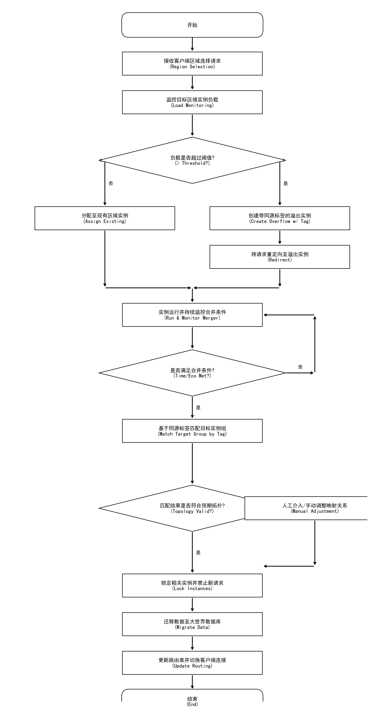

# 专利申请方案：基于动态分线与物理映射的MMO服务器无缝融合技术
*(Method for Seamless MMO Server Merging Based on Dynamic Branching and Physical Mapping)*

## 1. 技术领域
本发明涉及网络游戏服务器架构领域，特别是涉及一种大规模多人在线游戏（MMO）中基于地理空间切片与动态负载均衡的服务器实例管理及数据合并技术。

## 2. 背景技术与现有技术痛点
在现有的MMO服务器架构中，普遍存在以下技术瓶颈：

1.  **静态服务器架构导致的社交割裂 (Static Sharding Isolation):**
    *   **现有技术：** 传统架构在用户注册阶段即要求选择固定的物理服务器（Server ID），数据被强绑定于该单一数据库实例。
    *   **缺陷：** 这种强绑定导致不同服务器间的用户数据无法实时交互。一旦目标服务器达到并发连接数上限（CCU Cap），新用户被迫分流至其他服务器，造成预定社交关系的物理阻断。

2.  **资源利用率与用户体验的矛盾 (Resource Utilization vs UX):**
    *   **现有技术：** 为了应对开服峰值，运营商往往开启大量服务器。
    *   **缺陷：** 随着生命周期推移，用户流失导致大量“僵尸服”（低活跃服务器），不仅造成硬件资源浪费，还破坏了依赖大规模用户互动的游戏生态。

3.  **传统合服技术的滞后性与破坏性:**
    *   **现有技术：** 传统的服务器合并（Server Merge）通常作为事后补救措施，需要停机维护，涉及复杂的离线数据清洗和ID冲突解决。
    *   **缺陷：** 这种操作通常发生在运营后期，且对用户体验具有破坏性（如强制改名、排行榜重置），无法解决开服初期的生态密度问题。

## 3. 发明内容与核心技术逻辑
本发明提出了一种**“基于预设拓扑结构的动态实例组装系统”**。其核心在于打破传统的“服务器”概念，将游戏世界划分为可动态实例化的“地理切片（Zone）”，并通过“物理映射标签”在时间轴上实现确定性的自动合并。

本方案涉及两个部分的控制流程：
*   **A - 用户与交互界面的交互流程：** 侧重于客户端软件系统的模块构成及用户操作反馈。
*   **B - 底层请求与配置流程：** 侧重于服务器端的资源分配、动态负载均衡及数据合并逻辑。

## 4. 具体实施方式 (Detailed Description)

### 4.1 部分 A：用户与交互界面的交互流程 (User Interaction Flow)

#### 4.1.1 客户端软件系统架构
为了实现动态分线与无缝融合，客户端软件系统主要由以下模块构成：
1.  **UI展示层 (View Layer):** 负责渲染动态地图界面，展示可选区域（Region A/B/C/D）及其负载状态（如“畅通”、“拥挤”、“爆满”）。
2.  **区域管理模块 (Zone Manager - Client):** 负责维护当前的区域列表数据，解析服务器下发的区域元数据（包括ZoneID、物理标签、倒计时状态）。
3.  **网络通信层 (Network Layer):** 负责封装用户的选区请求（ZoneSelectReq），并处理服务器的动态路由指令（RedirectNtf）。

#### 4.1.2 交互流程详解（主场景：初始选区）
1.  **界面初始化：** 用户登录后，客户端向服务器请求当前可用的“新旅程”列表。
2.  **地图展示：** UI层根据返回数据，展示一张完整的世界地图，被划分为 A、B、C、D 四个物理区域。此时用户看不到具体的服务器ID，只能看到基于地理位置的选项。
3.  **用户决策：** 用户根据社交约定（如“我们去左上角”）点击“Region A”。
4.  **请求发送：** 客户端发送选区请求，携带参数 `{Region: "A", Version: "New_Journey"}`。
5.  **反馈响应：** 
    *   若请求成功，客户端直接加载游戏场景。
    *   若触发溢出逻辑（见下文），UI层可能弹出提示：“该区域当前火爆，正在为您分配至扩展分线（承诺后续合并）”，用户确认后进入。

### 4.2 部分 B：底层请求、数据与服务器的配置流程 (Configuration & Underlying Process)

#### 4.2.1 服务器端系统架构
1.  **网关/负载均衡器 (Gateway):** 处理所有客户端连接，维护 `SessionID -> ZoneInstance` 的路由表。
2.  **区域管理器 (Zone Manager Service):** 核心中枢，负责监控所有Zone实例的负载，动态创建/销毁容器，并维护物理映射关系。
3.  **Zone实例集群 (Zone Instances):** 动态生成的轻量级游戏服务进程（如 Docker 容器）。
4.  **大世界数据库 (Mega-Server DB):** 最终数据归档的目标数据库。

#### 4.2.2 流程详解：主场景（常规分配）
1.  **接收请求：** 网关接收到用户对 "Region A" 的选择请求。
2.  **查询可用性：** 网关询问区域管理器：“Region A 当前有哪些可用实例？”
3.  **负载判断：** 区域管理器检查 `Zone_A_1` 的实时负载（例如 35/50 人）。
4.  **绑定配置：** 
    *   因负载未满，管理器返回 `Zone_A_1` 的连接信息。
    *   网关建立路由映射：`User_Session -> Zone_A_1`。
    *   **关键配置：** 在用户数据中写入物理标签 `Physical_Tag: Region_A_Group_1`。

#### 4.2.3 流程详解：子场景（动态溢出/Overflow）
当短时间内大量用户涌入 Region A，触发**高负载**场景：
1.  **触发监控：** 区域管理器检测到 `Zone_A_1` 负载超过 80%（或等待队列 > 阈值）。
2.  **实例派生：** 管理器指令云设施启动新实例 `Zone_A_1_Overflow`。
3.  **同源标签配置：** 
    *   系统为新实例配置与主实例相同的**同源标签 (Homologous Tag)**：`Group_ID: Alpha_Squad`。
    *   这意味着 `Zone_A_1` 和 `Zone_A_1_Overflow` 在逻辑上属于同一个“未来的服务器”。
4.  **流转变化：** 后续对 "Region A" 的请求将被自动重定向至 `Zone_A_1_Overflow`。

#### 4.2.4 流程详解：特殊场景（动态合并/Merger）
当满足预设条件（如开服48小时或生态成熟）时，触发合并流程。**本方案特别引入了拓扑校验与人工干预机制，以确保合并的准确性。**

1.  **基于同源标签匹配目标实例组：** 系统检索所有带有相同 `Group_ID` 的实例。
2.  **拓扑验证与人工干预 (Topology Validation & Manual Adjustment)：**
    *   **系统自检：** 验证检索到的实例组是否覆盖了完整的世界地图拓扑（如必须包含 Region A+B+C+D）。
    *   **异常处理：** 若系统检测到拓扑缺失（例如缺少 Region C 的实例），将触发**告警**并暂停自动化流程，转入**人工干预模式**。
    *   **手动调整：** 运维人员可手动指定或修正映射关系，确认无误后重新提交合并指令。
3.  **锁定阶段：** 确认拓扑无误后，锁定该组所有实例，停止接纳新用户。
4.  **数据迁移配置：** 
    *   底层数据库执行批处理：将分散在各个 Zone 临时库中的数据，依据 `Physical_Tag` 迁移至 `Mega_Server_Alpha_DB`。
    *   由于预先使用了全局唯一ID（UUID），此过程无需处理ID冲突。
5.  **信令流转更新：** 
    *   网关更新路由表：所有原 `Zone_A_1` 及 `Zone_A_1_Overflow` 的活跃连接，目标地址瞬间切换至新的 `Mega_Server_Process`。
    *   客户端无需断线重连，仅感知到周围玩家数量突然增加（完成了物理汇合）。

### 4.3 整体控制流程图 (Flowchart)
为了更直观地展示上述逻辑，特别是动态分流与人工干预的判断逻辑，请参考附图 `scheme_flowchart.jpg`。

## 5. 权利要求书 (Claims)

1.  一种基于动态分线与物理映射的大规模多人在线游戏服务器架构方法，其特征在于，包括：
    *   **初始分流步骤**：接收客户端的区域选择请求，将客户端连接分配至对应的初始区域实例（Zone Instance）；
    *   **动态溢出步骤**：监控所述初始区域实例的负载状态，当负载超过预设阈值时，自动创建具有相同物理空间映射标签的溢出实例，并将后续请求重定向至该溢出实例；
    *   **拓扑验证与合并步骤**：在满足预设合并条件时，基于所述物理空间映射标签检索目标实例组，并对实例组进行拓扑完整性校验；
    *   **数据迁移步骤**：当拓扑校验通过或经人工确认后，将多个关联实例的用户数据迁移至同一个目标服务器数据库中，并将所有相关客户端连接切换至该目标服务器。

2.  根据权利要求1所述的方法，其特征在于，所述物理空间映射标签用于标识该实例对应的游戏世界地理区域及所属的服务器组。

3.  根据权利要求1所述的方法，其特征在于，所述合并操作在不关闭客户端连接的情况下通过网关层的路由热更新实现。

4.  根据权利要求1所述的方法，其特征在于，当拓扑校验未通过时，系统自动挂起合并流程并触发人工干预接口，允许手动修正实例映射关系。

## 6. 本技术方案的有益效果
1.  **社交连续性保障：** 通过同源标签机制，确保了即使在分流阶段被隔离的玩家，在最终合并后必然处于同一服务器实例。
2.  **极高的资源弹性：** 允许服务器架构从“微型实例集群”平滑演进为“单体巨型实例”。
3.  **高可靠性：** 引入拓扑验证与人工干预机制，避免了因自动化逻辑异常导致的合服错误（如丢服、错服），保障了大规模运营的安全性。
